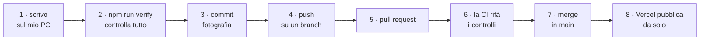

# Dall'AS/400 al web

Documento di traduzione. A sinistra ciò che il Product Owner conosce da
trent'anni, a destra l'equivalente in questo progetto — con l'avvertenza, ogni
volta che serve, di **dove il paragone si rompe**.

Nasce dalla regola **R6** di `AGENTS.md`: un paragone approssimativo dichiarato
come tale aiuta; un paragone sbagliato spacciato per esatto fa danno.

Cresce man mano che i concetti si incontrano. Se una voce manca, va aggiunta
quando serve, non prima.

---

## 1. Dove vive il codice

| AS/400 | Qui | Dove il paragone si rompe |
|---|---|---|
| Libreria (`*LIB`) | Cartella nel filesystem | Nessuna *library list*: non esiste un ordine di ricerca implicito. Ogni riferimento a un file è esplicito. |
| Source physical file + membro | File di testo | Un membro sorgente vive dentro un oggetto database; qui un file è solo un file su disco. |
| PDM, SEU | VS Code | |
| Oggetto `*PGM` compilato | Non esiste un equivalente permanente | Vedi §3: qui il "compilato" è temporaneo e ricostruibile. |
| `*LIBL` | `import` espliciti | La dipendenza è scritta nel file che la usa, non nell'ambiente in cui gira. |

**La differenza che conta:** su AS/400 il sorgente e l'oggetto compilato
convivono sulla macchina, e l'ambiente decide cosa trovi. Qui esiste **solo il
sorgente** come verità; tutto il resto è generato e buttato via di continuo.

---

## 2. Il controllo di versione: git

Non ha un equivalente diretto su AS/400. Ci si avvicina il **journaling**, ma la
differenza è sostanziale.

| Concetto | Cosa significa |
|---|---|
| **Repository** | L'intero progetto **più tutta la sua storia**, dal primo giorno. Non un archivio di backup: la storia è consultabile e navigabile. |
| **Commit** | Una fotografia coerente di tutti i file, con un messaggio che dice *perché* è cambiato qualcosa. L'unità minima di storia. |
| **Branch** | Una linea di lavoro parallela. Si lavora lì senza toccare la versione buona. Costa quasi nulla crearne uno. |
| **`main`** | Il branch principale: la versione considerata valida. È quella che finisce online. |
| **Merge** | Riportare il lavoro di un branch dentro `main`. |
| **Pull request (PR)** | La richiesta di fare quel merge, con una descrizione e una revisione prima. |
| **Push / pull** | Mandare i propri commit al server condiviso, e prendere quelli altrui. |

**L'analogia con il journaling e dove si rompe:** il journal registra *cosa* è
cambiato in un file, per poterlo rifare o disfare. Git registra *stati completi*
del progetto e **perché**, e permette di lavorare su più versioni in parallelo
per poi ricombinarle. Il journal è uno strumento di recupero; git è uno
strumento di collaborazione.

**Perché tanti branch in questo progetto:** perché `main` deve restare sempre
funzionante — è quello che viene pubblicato. Un errore scritto direttamente lì
andrebbe online immediatamente.

---

## 3. Compilare, e perché qui è diverso

Su AS/400 si compila una volta e l'oggetto `*PGM` resta: è una cosa reale, che
occupa spazio, che si può salvare e ripristinare.

Qui il processo si chiama **build** e produce roba **temporanea**:

| Passaggio | Cosa fa |
|---|---|
| **TypeScript → JavaScript** | I browser capiscono solo JavaScript. TypeScript aggiunge i tipi, che servono a noi e ai controlli, e poi vengono **rimossi**. Si chiama *transpilazione*: da linguaggio a linguaggio, non da linguaggio a codice macchina. |
| **Bundling** | Centinaia di file diventano pochi file grandi, perché ogni file scaricato separatamente è una richiesta di rete in più. |
| **Minificazione** | Nomi accorciati, spazi tolti: il codice diventa illeggibile ma pesa meno. |

Il risultato finisce in una cartella `.next/` che **non viene versionata** e si
può cancellare in qualsiasi momento: si rigenera con `npm run build`.

**Il capovolgimento rispetto all'AS/400:** lì l'oggetto compilato è il
patrimonio, e il sorgente serve a rifarlo. Qui il sorgente è il patrimonio, e il
compilato è materiale di consumo.

---

## 4. Le dipendenze: npm e `node_modules`

Su AS/400 le API di sistema ci sono e basta: fanno parte del sistema operativo.

Qui quasi tutto arriva da **pacchetti** scaricati da un archivio pubblico
(*npm registry*).

| File | Cosa contiene |
|---|---|
| `package.json` | L'elenco di ciò che il progetto **dichiara** di usare, con i vincoli di versione |
| `package-lock.json` | Le versioni **esatte** installate, comprese le dipendenze delle dipendenze |
| `node_modules/` | I pacchetti veri e propri: migliaia di file, **mai versionati** |

Il comando `npm ci` legge il lock e ricostruisce `node_modules/` identica ovunque
— sul tuo PC, sulla macchina di un altro, sul server di build.

**Il rischio che non esiste su AS/400:** stai eseguendo codice scritto da
sconosciuti. Per questo `AGENTS.md` §3 vieta di aggiungere una dipendenza senza
una decisione motivata, e suggerisce di scrivere venti righe proprie in caso di
dubbio.

---

## 5. Il database

| AS/400 | Qui |
|---|---|
| DB2 for i | PostgreSQL (servizio Neon) |
| DDS o SQL DDL | Schema dichiarato in TypeScript con Drizzle |
| `CRTPF` / `ALTER TABLE` eseguiti a mano | **Migrazioni**: file SQL numerati e versionati |
| Commitment control | Transazioni |
| Journaling | Write-ahead log (interno, non lo tocchiamo) |

**Le migrazioni sono il concetto nuovo.** Ogni modifica allo schema diventa un
file numerato, salvato nel repository accanto al codice. Il database tiene il
conto di quali ha già applicato.

Perché conta: chiunque, ovunque, parte da un database vuoto e arriva alla stessa
struttura eseguendo gli stessi file nello stesso ordine. Non esiste il momento
"ho modificato la tabella in produzione e non me lo ricordo".

Il DDS descrive **com'è** un file; una migrazione descrive **come ci si arriva**.

---

## 6. Dove gira l'applicazione

Su AS/400 il programma gira sulla macchina, e la macchina è lì.

Qui l'applicazione gira su **Vercel**, in modalità *serverless*: non esiste un
processo sempre acceso. Arriva una richiesta, viene avviato qualcosa, risponde,
e sparisce.

Conseguenze concrete, non teoriche:

- **Niente stato in memoria fra due richieste.** Una variabile globale non
  sopravvive: la richiesta successiva potrebbe essere servita da un'altra
  macchina.
- **Le connessioni al database vanno gestite diversamente.** Da qui la
  distinzione fra stringa *pooled* e *diretta* in `.env.local`.
- **Il primo accesso dopo una pausa è lento.** Il piano gratuito di Neon spegne
  il database e deve riaccenderlo (*cold start*).

Non c'è un equivalente su AS/400: è un modello di esecuzione diverso, non una
variante dello stesso.

---

## 7. La configurazione: variabili d'ambiente

Su AS/400 la configurazione sta in data area, file di configurazione, variabili
d'ambiente di sistema.

Qui sta nelle **variabili d'ambiente**: coppie nome/valore che il programma legge
all'avvio.

| Dove | Cosa |
|---|---|
| `.env.local` | Sul tuo PC. **Mai versionato**: contiene password vere. |
| `.env.example` | Versionato. Contiene i **nomi** delle variabili, mai i valori. |
| Pannello Vercel | I valori di produzione |

**La regola che non ha equivalente:** un segreto non entra mai nel repository.
Una volta dentro, resta nella storia per sempre — e la storia è pubblica se il
repository lo è.

---

## 8. I test

Su AS/400 si prova il programma in un ambiente di collaudo, spesso a mano.

Qui i test sono **codice che verifica altro codice**, eseguibile in qualsiasi
momento, su tre livelli:

| Livello | Cosa verifica | Quanto ci mette |
|---|---|---|
| **Unitari** (Vitest) | Una funzione alla volta, senza database né rete | secondi |
| **Integrazione** | Il codice contro un database vero | qualche secondo |
| **End-to-end** (Playwright) | Un browser vero che clicca sull'applicazione vera | un paio di minuti |

`npm run verify` esegue i primi e, insieme a loro, controlla i tipi e le regole
di stile. È il cancello: finché non passa, il lavoro non è finito (regola R5).

**Perché sono scritti come codice e non fatti a mano:** perché una prova manuale
verifica il momento in cui la fai, mentre un test scritto verifica **ogni volta**,
per sempre, anche fra sei mesi quando nessuno ricorda più che quel caso limite
esisteva.

---

## 9. Il ciclo completo, dal codice al sito

I passi 6 e 8 sono automatici: nessuno li avvia.

**Cosa non esiste su AS/400:** il passo 8. Non c'è un momento in cui "si mette in
produzione" con un comando. Il sistema osserva il repository e, quando `main`
cambia, ricostruisce e pubblica. Il merge *è* la messa in produzione.

---

## 10. Parole che ricorrono

| Parola | Significato qui |
|---|---|
| **Runtime** | L'ambiente che esegue il codice. Node.js sul server, il motore JavaScript nel browser. |
| **Framework** | Impalcatura che impone una struttura e fornisce le parti comuni. Qui: Next.js. |
| **Serverless** | Codice eseguito su richiesta, senza un processo permanente. |
| **Endpoint** | Un indirizzo che risponde a una richiesta. Vagamente: un programma richiamabile dall'esterno. |
| **Deploy** | Pubblicare una versione. |
| **Rollback** | Tornare a una versione precedente. Su Vercel: due click, il vecchio deploy è ancora lì. |
| **Hot reload** | Durante lo sviluppo, la pagina si aggiorna da sola appena salvi. |
| **Linting** | Controllo automatico dello stile e degli errori tipici, prima ancora di eseguire. |
| **Type checking** | Verifica che i tipi siano coerenti. Avviene prima dell'esecuzione, come una compilazione, ma non produce niente. |
| **CI** | *Continuous Integration*: un server che rifà i controlli a ogni modifica, per non fidarsi del PC di chi ha scritto. |

---

## Come si aggiorna questo file

Quando incontri un concetto che non conosci, chiedilo: la spiegazione entra qui.
Il documento serve a te, quindi cresce sulle tue domande — non su ciò che un
agente immagina tu debba sapere.
