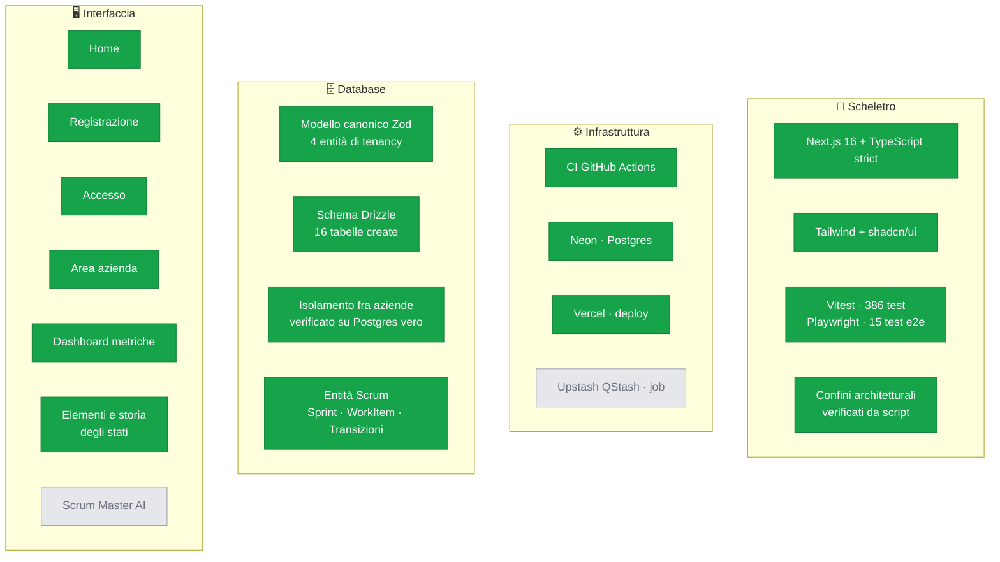
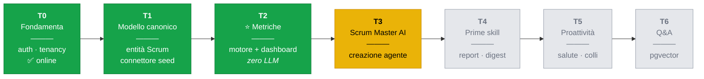
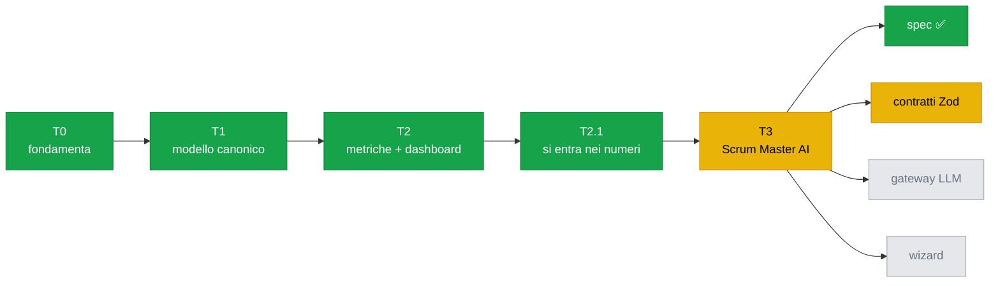

# Stato del progetto

> Fotografia aggiornata a ogni fine sviluppo. Se una casella è verde, esiste **ed è
> stata verificata**; se è gialla è in corso; se è grigia non è ancora iniziata.
>
> Ultimo aggiornamento: **22/08/2026** — T0, T1 e T2 in `main` (PR #2 → #15),
> applicazione online, T3 iniziato dalla specifica.

---

## 1. I quattro livelli, a colpo d'occhio

**Come leggerlo:** scheletro, database e metriche sono solidi e verificati in un
browser, non solo dai test. Ogni numero della dashboard è ora **apribile**: si
arriva agli elementi che lo compongono e alla storia degli stati da cui è
calcolato. Resta da costruire lo Scrum Master AI vero e proprio — la parte che dà
il nome al prodotto. I job schedulati non servono ancora.

---

## 2. Roadmap dei traguardi

**T2 è il traguardo che dà credibilità al resto**: tutti i numeri che
l'applicazione mostra sono calcolati da codice deterministico e testato. Nessun
modello linguistico li ha toccati. T3 è il primo in cui un LLM entra davvero, e
la regola R1 — il codice calcola, l'LLM racconta — smette di essere teorica.

---

## 3. Cosa è vivo, e dove

| Ambiente | Stato | Dettaglio |
|---|---|---|
| **Locale** | ✅ funzionante | `npm run dev`, giro completo provato in Chrome |
| **Neon (Postgres)** | ✅ attivo | 16 tabelle, migrazioni applicate, popolato con 51 elementi e 222 transizioni sintetiche |
| **CI (GitHub Actions)** | ✅ configurata | typecheck, lint, test, build, confini |
| **Vercel** | ✅ **online** | protezione disattivata, verificato `200`; accesso e isolamento funzionanti sul dominio pubblico |
| **Upstash QStash** | ⬜ non serve ancora | chiavi presenti, primo uso previsto a T5 |

### Come guardarci dentro

Istruzioni per il Product Owner in
[`guardare-i-dati.md`](guardare-i-dati.md): dal sito pubblicato, in locale, o
interrogando direttamente il database con SQL.

**L'applicazione online e il computer di sviluppo usano lo stesso database.** Non
ci sono due copie dei dati. È comodo per una dimostrazione e va cambiato prima di
avere dati veri: oggi un `npm run seed` sbagliato tocca ciò che si vede online.

---

## 4. Dove siamo

**T2.1 non era in roadmap.** È nato da un'osservazione del Product Owner: la
dashboard dichiarava un cycle time mediano su 44 elementi e non c'era modo di
vedere quali. Un numero in cui non si può entrare è un numero che si deve
accettare per fede.

Nessun passaggio è più bloccato su una persona. Restano **tre** cose che
attendono il Product Owner, nessuna delle quali ferma lo sviluppo:

| Questione | Dove | Effetto se non decisa |
|---|---|---|
| **Q2** — un elemento bloccato fa parte del carico? | [glossario](domain-glossary.md) | il WIP continua a escluderlo |
| `LLM_API_KEY` su Vercel va rinominata | [messa-in-linea](messa-in-linea.md) | nessuno finché il provider è `fake`; con un fornitore vero la chiave non verrebbe letta |
| Rotazione della password Neon | §5 qui sotto | nessuno finché i dati sono sintetici |

Le **otto questioni aperte** della specifica di T3 hanno tutte una risposta
provvisoria motivata, quindi non bloccano nulla. Due sono già state decise (Q3 e
Q4) applicando lo stesso criterio: **fra due scelte difendibili si prende quella
reversibile**, e su un'autorizzazione non si sceglie mai la permissiva in
silenzio.

---

## 5. Debito registrato

Cose note e volutamente rimandate, non sviste:

| Voce | Dove è documentata | Quando va affrontata |
|---|---|---|
| Nessuna limitazione di frequenza sull'accesso | `AGENTS.md` §8.1 | ora che il sito è pubblico, prima dei dati veri |
| Revoca di `Membership` non immediata | ADR-0006 | prima di un uso reale |
| Nessuna verifica dell'indirizzo email | ADR-0006 | dopo il PoC |
| Nessun recupero password | — | dopo il PoC |
| Password Neon comparsa in chiaro, mai ruotata | decisione consapevole del PO | prima dei dati veri |
| Sviluppo e produzione condividono il database | §3 qui sopra | prima dei dati veri |
| `LLM_API_KEY` su Vercel non verrà mai letta | [messa-in-linea](messa-in-linea.md) | prima di usare un fornitore vero |
| `reviewWaitTime` misura lo stato, non la pull request | [glossario](domain-glossary.md) | con il connettore GitHub |
| Spec-first mai usato | `AGENTS.md` §5 | ~~da T3 in poi~~ **fatto**: `specs/scrum-agent/spec.md` scritta prima del codice |
| Agenti specializzati mai usati | `docs/agent-workflow.md` | ~~da T3 in poi~~ **in corso**: `product-analyst` e `architect` usati su T3 |
| `npm run test:e2e` è un segnaposto | — | ~~quando le pagine si moltiplicano~~ **fatto**: 15 test Playwright su Chrome |
| Registrazione dal browser non provata end-to-end | — | ~~serve Playwright~~ **fatto** |
| Strumenti di lavoro fuori dal repository | — | ~~sparirebbero con la sessione~~ **fatto**: PR #14 |

---

## 6. Come si aggiorna questo file

Va riscritto **alla fine di ogni sviluppo**, insieme al codice che descrive.
Un diagramma che mente è peggio di nessun diagramma.

Regole:

- una casella è verde **solo** se è stata verificata, non se è stata scritta
- ciò che è bloccato su una persona va detto, con la ragione
- il debito si aggiunge quando lo si crea, non quando lo si paga

**I diagrammi vanno controllati prima di consegnarli.** Un blocco Mermaid con un
errore di sintassi non sparisce: GitHub lo sostituisce con un riquadro rosso, e il
risultato è peggio dell'assenza del diagramma. Il modo più rapido, senza aggiungere
dipendenze al progetto, è incollarlo su [mermaid.live](https://mermaid.live).

I tre diagrammi di questo file sono stati validati con il parser di Mermaid 11.
