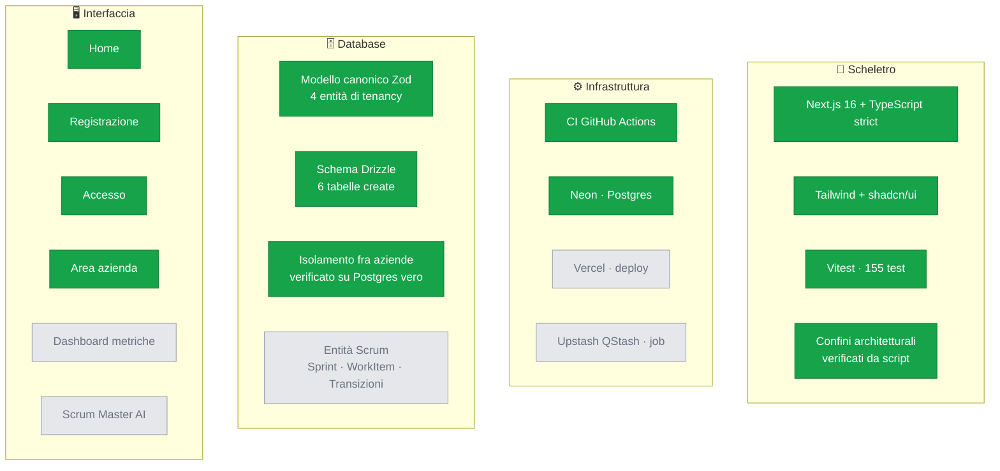
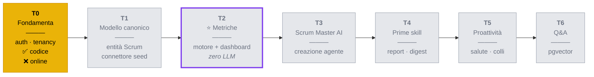
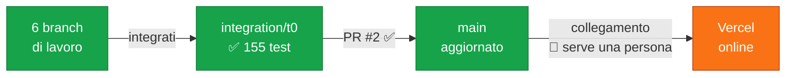

# Stato del progetto

> Fotografia aggiornata a ogni fine sviluppo. Se una casella è verde, esiste **ed è
> stata verificata**; se è gialla è in corso; se è grigia non è ancora iniziata.
>
> Ultimo aggiornamento: **20/08/2026** — T0 integrato in `main` (PR #2).

---

## 1. I quattro livelli, a colpo d'occhio

**Come leggerlo:** scheletro e database sono solidi. L'interfaccia esiste per tutto
ciò che serve a entrare nel prodotto. L'infrastruttura ha un buco: **il deploy non
esiste ancora**.

---

## 2. Roadmap dei traguardi

---

## 3. Cosa è vivo, e dove

| Ambiente | Stato | Dettaglio |
|---|---|---|
| **Locale** | ✅ funzionante | `npm run dev`, giro di accesso completo provato |
| **Neon (Postgres)** | ✅ attivo | 6 tabelle, 2 migrazioni applicate, database vuoto di dati |
| **CI (GitHub Actions)** | ✅ configurata | typecheck, lint, test, build, confini |
| **Vercel** | ❌ **inesistente** | nessun `vercel.json`, nessun `.vercel`, il dominio risponde `X-Vercel-Error: NOT_FOUND` |
| **Upstash QStash** | ⬜ non serve ancora | chiavi presenti, primo uso previsto a T5 |

### Perché Vercel manca

Il progetto non è mai stato collegato a Vercel. Non è una dimenticanza tecnica: è un
passaggio che richiede **un accesso interattivo al pannello** e la scelta di quale
branch pubblicare, quindi non è automatizzabile da un agente.

Finché `main` resta al commit di scaffolding, pubblicarlo mostrerebbe comunque solo
la pagina iniziale: il deploy ha senso **dopo** il merge dell'integrazione.

---

## 4. Il collo di bottiglia attuale

Il codice di T0 è **in `main`**. Resta un solo passaggio, e richiede una persona:
**collegare il repository a Vercel** e impostare le variabili d'ambiente, perché
serve accesso al pannello.

Finché non è fatto, T0 non è ancora *dimostrabile*: la roadmap chiede «ci si
registra come azienda **ed è online**». Procedura in
[`messa-in-linea.md`](messa-in-linea.md).

---

## 5. Debito registrato

Cose note e volutamente rimandate, non sviste:

| Voce | Dove è documentata | Quando va affrontata |
|---|---|---|
| Nessuna limitazione di frequenza sull'accesso | `AGENTS.md` §8.1 | prima di qualunque esposizione pubblica |
| Revoca di `Membership` non immediata | ADR-0006 | prima di un uso reale |
| Nessuna verifica dell'indirizzo email | ADR-0006 | dopo il PoC |
| Nessun recupero password | — | dopo il PoC |
| `npm run test:e2e` è un segnaposto | — | quando le pagine si moltiplicano |
| Registrazione dal browser non provata end-to-end | — | serve Playwright |

---

## 6. Come si aggiorna questo file

Va riscritto **alla fine di ogni sviluppo**, insieme al codice che descrive.
Un diagramma che mente è peggio di nessun diagramma.

Regole:

- una casella è verde **solo** se è stata verificata, non se è stata scritta
- ciò che è bloccato su una persona va detto, con la ragione
- il debito si aggiunge quando lo si crea, non quando lo si paga

**I diagrammi vanno controllati prima di consegnarli.** Un blocco Mermaid con un
errore di sintassi non sparisce: GitHub lo sostituisce con un riquadro rosso, e il
risultato è peggio dell'assenza del diagramma. Il modo più rapido, senza aggiungere
dipendenze al progetto, è incollarlo su [mermaid.live](https://mermaid.live).

I tre diagrammi di questo file sono stati validati con il parser di Mermaid 11.
