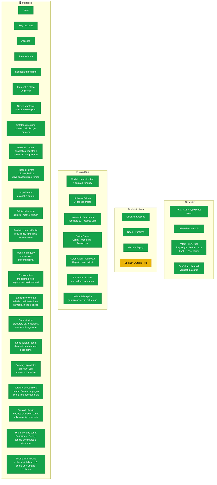
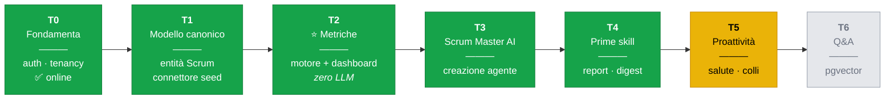
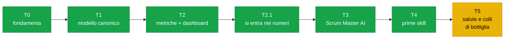

# Stato del progetto

> Fotografia aggiornata a ogni fine sviluppo. Se una casella è verde, esiste **ed è
> stata verificata**; se è gialla è in corso; se è grigia non è ancora iniziata.
>
> Ultimo aggiornamento: **27/08/2026** — T0→T5 (primo incremento) in `main`,
> applicazione online. Ogni entità del modello canonico che contiene dati ha una
> schermata, e la dashboard dice come sta andando lo sprint **aperto**. Le formule
> dei calcoli sono ora ancorate a un libro dichiarato, non a scelte nostre
> ([ADR-0008](architecture/ADR-0008-fedelta-al-libro.md)).
>
> **Il libro è finito, per quanto un libro possa finire.** `npm run libro` dice
> **97,3 % fatto per intero** — 36 voci su 37. L'unica non chiusa è «segnali
> d'allarme della lavagna», e resta gialla **per onestà, non per lavoro
> mancante**: la pagina che li elencava è un'immagine, sei dei sette segnali sono
> implementati, e il settimo — «qualcuno non sa cosa fare» — non lascia traccia
> nei dati. Nella stessa categoria delle voci umane della checklist del capitolo
> 16: dichiarate, non fatte sparire.
>
> Due voci che sembravano debito non lo erano. **R4** (rivedere il piano dopo
> ogni sprint) era già implementata da quando esiste il piano di rilascio. **G3**
> (la quota di tech story) è una misura che il libro dice esplicitamente di *non*
> costruire: «no need for elaborate tracking schemes […] just use gut feel».
>
> Ed è nato il **primo connettore verso uno strumento reale**: Jira Cloud
> ([ADR-0009](architecture/ADR-0009-primo-connettore.md)).
>
> **Ed è stata presa una decisione di prodotto**: la chiave del modello la porta
> chi usa il portale ([ADR-0010](architecture/ADR-0010-chiavi-del-cliente.md)).
> Costo zero per noi, nessun legame con un fornitore — e in cambio l'obbligo di
> custodire segreti altrui, che ora sono cifrati a riposo. La configurazione si
> inserisce da `/progetti/<nome>/impostazioni`.

---

## 1. I quattro livelli, a colpo d'occhio

**Come leggerlo:** tutto ciò che si vede è stato verificato in un browser, non solo
dai test. Ogni numero della dashboard è **apribile** fino alla storia degli stati da
cui è calcolato, e un progetto può avere il proprio Scrum Master AI con un registro
delle esecuzioni. Le pagine sono verificate **a 375, 640, 768 e 1280 pixel**: nessun
testo sotto i 10 pixel resi, nessuno sbordamento laterale.

**Tutte e cinque le cerimonie Scrum ora lasciano un segno.** La retrospettiva era
l'ultima a non produrre niente: si poteva metterla in calendario, e poi il
prodotto non sapeva dire se avesse cambiato qualcosa. Ora ci sono le tre colonne
del libro — cosa rifaremmo uguale, cosa faremmo diversamente, cosa proviamo a
migliorare — il voto, e soprattutto **il seguito**.

Il seguito è il punto. «Focus on just a few improvements per sprint» è un
consiglio che significa qualcosa solo se qualcuno poi controlla che quei pochi
siano avvenuti; una schermata che elencasse soltanto ciò che è stato detto
sarebbe un modo più curato di dimenticare. Sui dati sintetici: **3 aperti su 6,
il 40 % di quelli considerati portato a termine, e il più vecchio aperto da 23,6
giorni** contro i 12 che di solito bastano.

Tre decisioni dichiarate, tutte discendenti da §8.2:

- **Nessun autore su una nota.** Il formato del libro è un muro di Post-it
  anonimi; attaccarci un nome trasformerebbe «cosa poteva andare meglio» nel
  registro di chi si è lamentato — il modo più rapido per far smettere una
  squadra di dire qualcosa — e metterebbe un conteggio per persona a una query
  di distanza.
- **I voti sono totali, e si mostrano solo da tre partecipanti in su.** Con due
  persone nella stanza un totale dice quasi esattamente come ha votato ciascuna:
  l'aggregato smette di essere un aggregato.
- **Niente umore, niente clima, nessun punteggio.** La retrospettiva è
  esattamente il punto in cui un prodotto ben intenzionato comincerebbe a
  inferire stati d'animo. Si conserva ciò che le persone hanno **detto**.

E **«lasciato cadere» è un esito legittimo**, non un fallimento: il libro ammette
di decidere di non agire, quindi quei miglioramenti escono dal denominatore.
Offrire solo «fatto» o «non fatto» insegnerebbe a chiudere per finta.

Uno sprint ancora aperto non ha retrospettiva — guarderebbe indietro a qualcosa
che non è ancora successo — e gli sprint **chiusi senza** vengono elencati invece
che taciuti: è un fatto sulla squadra, e ometterlo lascerebbe sparire l'abitudine
in silenzio.

---

**Il capitolo 16 per intero: la checklist dello Scrum Master, e la pagina
informativa che essa nomina.** Erano due voci separate nel nostro elenco, ma il
libro le tratta come un solo flusso — la prima riga della checklist è «dopo la
pianificazione, crea la sprint info page» — quindi sono state fatte insieme.

**La pagina informativa esiste per una ragione precisa:** «It is important to
keep the whole company informed about what is going on. Otherwise, people will
complain or, even worse, **make false assumptions** about what is going on»
(pag. 52). Nel libro la scrive a mano lo Scrum Master dopo la pianificazione, la
mette sul wiki e la stampa.

Qui è **generata**, ed è l'unica cosa in cui questa versione batte quella di
carta: una pagina scritta una volta descrive lo sprint com'era quel giorno, e uno
sprint che si muove la rende silenziosamente falsa. Questa non può invecchiare.

**La checklist ha tutte e quattordici le voci**, nei tre momenti del libro — e la
parte che conta è la colonna a destra. Sui dati veri, sullo sprint in corso:

| | |
|---|---|
| ✅ fatto | pagina informativa · previsione registrata · 3 ingressi dopo l'inizio · lavagna aggiornata ieri |
| ⬜ da fare | 1 impedimento ancora aperto |
| 👤 lo sa solo chi c'era | 6 voci |
| non ancora | demo, retrospettiva e statistiche di fine: lo sprint è aperto |

**Metà delle voci nessun portale può spuntarle**, e restano visibili marcate come
umane. Spuntare da sola «il daily scrum inizia in orario» sarebbe una bugia;
ometterla farebbe sembrare il mestiere dello Scrum Master più piccolo di quanto
sia. Il libro chiude la checklist proprio così: «over time, try to make yourself
**redundant**».

Anche il riassunto rispetta la distinzione: dice «4 su 5 **verificabili**», non
«4 su 14». Mettere le voci umane nel denominatore produrrebbe un numero che si
legge come una squadra indietro, mentre quelle dieci non sono in ritardo — solo,
nessun database sa se siano state fatte.

> **Un difetto mio, trovato da un test.** «Avvisare della demo un giorno o due
> prima» contava millisecondi: il 15 aprile alle 9, uno sprint che finisce il 17
> alle 17 è a 2,33 giorni, e arrotondando diventa «3». Ma una persona che guarda
> un calendario dice «dopodomani», che è due. La regola del libro è espressa in
> giorni umani, quindi l'aritmetica dev'essere in giorni umani — altrimenti il
> promemoria scatta la mattina sbagliata.

> **E un punto cieco nella guardia del catalogo.** Il test che verifica «ogni
> entità dichiarata compare davvero nella firma» seguiva solo `export type`, non
> `export interface`. Non era che rifiutasse qualcosa di valido: **accettava
> senza guardare**. Una metrica che riceveva un'interfaccia passava il controllo
> con le sue entità mai verificate. Stessa classe del buco in `pr-merge` di ieri,
> e chiuso allo stesso modo.

---

**La Definition of Ready, e la parte di essa che il portale sa verificare da
solo.** Il libro la introduce in coppia con la Definition of Done: «definition of
done is a checklist for when a story is **done**, and definition of ready is a
checklist for when a story is **ready to be pulled into a sprint**».

Sarebbe stato facile fermarsi lì — un secondo elenco di frasi accanto al primo.
Ma il libro dà anche la tecnica, ed è quella che rende la cosa utile invece che
decorativa:

> «The simplest technique is simply to make sure that **all the fields are
> filled in** for each story (or more specifically, for each story that has high
> enough importance to be considered for this sprint).»

E il suo esempio è esattamente un campo mancante: «This story named "Add user",
there is **no estimate** for that. Let's estimate!»

Quei campi il portale li conosce — stima, «come si dimostra», posizione — quindi
li **controlla**, e per ciascun elemento non pronto dice *che cosa* manca. «Non
pronta» da sola manderebbe a riaprire l'elemento per scoprirlo.

**Guarda solo la cima del backlog**, ed è il libro a dirlo: «for each story that
has high enough importance to be considered for this sprint». Quanto in
profondità non è un numero scelto da noi — è il primo sprint del piano di
rilascio, cioè esattamente ciò che verrebbe preso. Segnalare l'intero backlog
produrrebbe avvisi su cui nessuno può agire, e un avviso inagibile insegna a
saltare gli avvisi.

Sui dati veri il risultato è istruttivo da solo: la testa affinata del backlog è
di 5 elementi, il prossimo sprint ne prenderebbe **6**, quindi esattamente una
storia entrerebbe senza sapere come si dimostra. È il caso che il libro descrive,
riprodotto senza averlo costruito apposta.

**E dichiara ciò che non può controllare.** Che una squadra abbia davvero
*capito* una storia non è deducibile da una riga di database: quella parte resta
nella Definition of Ready dichiarata dal progetto, e la pagina lo dice invece di
lasciar credere che una spunta verde copra tutto.

---

voce rimasta che riguardava la *correttezza* di una metrica esistente, non una
funzione nuova — e per la regola R1 vale più di una funzione nuova.

Il libro tiene gli elementi non pianificati in un'area a sé sulla lavagna: «We've
had three **unplanned items**, as you can see down to the right. This is useful
to remember when you do the sprint retrospective» (pag. 60). La distinzione è
reale, e il portale la perdeva: un Product Owner che tira dentro altro lavoro
perché la squadra ha spazio sta **estendendo** il piano; un'interruzione lo sta
**rompendo**. Il conteggio unico non distingue una squadra che ha accettato altro
lavoro da una che è stata disturbata, e sono due conversazioni diverse da fare in
retrospettiva.

**Il campo sta sull'evento, non sull'elemento.** La stessa storia può essere
un'aggiunta voluta in uno sprint e un'interruzione in un altro: ciò che è
imprevisto è l'*arrivo*, non il lavoro. Metterlo sull'elemento avrebbe legato una
proprietà del momento a una cosa che dura.

**E ha tre stati, non due.** `null` significa «la fonte non lo dice», ed è la
condizione normale: Jira sa che un ticket è entrato in uno sprint, non se il
pomeriggio di qualcuno è stato dirottato. Schiacciare l'ignoto su «voluta»
nasconderebbe le interruzioni proprio dove sono più difficili da vedere; su
«interruzione» le gonfierebbe. Si riportano tutte e tre, e la dashboard lo dice a
parole: «Di questi, 2 sono interruzioni; 1 non lo dichiara».

Anche i dati di prova rispettano la cosa: lo scenario dichiara **una parte** delle
aggiunte come interruzioni e lascia il resto non dichiarato. Un dato in cui ogni
evento è classificato mostrerebbe la funzione al lavoro in una condizione che su
dati veri non si verifica quasi mai — e nasconderebbe proprio il caso che il
portale deve saper dichiarare.

---

sta in una frase: «Each sprint includes **as many stories as possible without
exceeding** the estimated velocity of 45» (pag. 100). Entrambe le metà contano.

*As many as possible* significa che la lista si percorre in ordine e non si
riordina mai per riempire meglio uno sprint: l'ordine è la decisione del Product
Owner, e migliorarlo vorrebbe dire cambiarla di nascosto. *Without exceeding*
significa che una storia che non entra apre lo sprint successivo, invece di
essere spezzata.

Il test non usa dati inventati: usa la **tabella di pagina 100**, con i suoi
tredici nomi di frutta e le stime stampate accanto. Il libro dichiara in quale
sprint finisce ciascuna storia, quindi è la risposta pubblicata — se il motore
non la riproduce, ha torto il motore.

L'esempio ha anche un dettaglio che non avremmo pensato di inventare: **le
ultime due righe non hanno stima**, perché il libro segue il proprio consiglio,
«Time-estimate the *most important* items». Quelle storie restano fuori dal
piano e vengono riportate a parte. Non valgono zero: una storia da zero punti è
gratis, una non stimata è ignota, e confonderle è il modo in cui un piano finisce
per promettere lavoro che nessuno ha dimensionato.

Sui dati veri il piano taglia il backlog in quattro sprint da 31, 16, 33 e 21
punti, con velocity **osservata** a 33,3 — lo sprint 2 si ferma a 16 perché il
successivo da 20 sforerebbe.

**La velocity non si chiede, si osserva.** È il «meteo di ieri» del libro: la
media dei punti chiusi negli sprint conclusi, e la pagina dichiara da dove viene.
Un campo da riempire sarebbe stato più facile e avrebbe prodotto una previsione
travestita da misura — il piano racconterebbe la speranza di chi lo ha scritto
invece della storia della squadra.

**Un caso che il libro non copre, e che va deciso.** Una storia più grande di uno
sprint intero non entra da nessuna parte. Saltarla farebbe sembrare la consegna
più vicina di quanto sia; cercarle un posto all'infinito sarebbe un difetto. Le
si dà uno sprint tutto suo, **dichiarato in sfondamento**, perché è la cosa vera:
quella storia va spezzata prima di poter essere pianificata.

C'è anche la variante a intervallo (pag. 101): stessa funzione eseguita due
volte, con la velocity minima e con la massima. Ciò che entra in entrambe è
**All**, ciò che entra solo nell'ottimista è **Some**, il resto è **None**. La
differenza fra i due piani *è* l'incertezza, e nominarla vale più che scegliere
un numero solo e far finta.

> **Il test ha corretto me, di nuovo.** Avevo calcolato a mano che a velocity 50
> entrasse una storia sola in più. Ne entrano due: dopo `orange` (41 punti) ci
> sta ancora `guava` da 8, per 49. Il conto sbagliato era il mio, e senza un test
> sull'esempio vero sarebbe finito in una pagina.

---

definisce «in terms of the contract» (pag. 97), ed è la parola che conta. Un
backlog ordinato dice cosa viene prima; una soglia dice **dove passa la linea
fra ciò che è dovuto e ciò che può aspettare**.

Sono tagli sull'ordine, non punteggi: le prime N posizioni sono obbligatorie, le
successive attese, e così via. Spostare un elemento più in alto lo rende
obbligatorio senza toccare nient'altro — e questo è il motivo per cui la fascia
si *deriva* dalla posizione invece di essere un'etichetta sull'elemento. Due
fonti per lo stesso fatto divergerebbero al primo riordino fatto senza
aggiornare l'etichetta.

Sui dati veri, con 3 obbligatori / 4 attesi / 2 dovuti dopo:

| Fascia | Se manca | Elementi | Stima |
|---|---|---|---|
| Obbligatorio nella 1.0 | il contratto è disatteso | 3 | 10 punti |
| Atteso nella 1.0 | si rimedia con un rilascio ravvicinato | 4 | 29 punti |
| Dovuto, ma in una versione successiva | una 1.1 è una consegna accettabile | 2 | 28 punti |
| Ipotetico | nessun impegno | 3 | 34 punti |

**Quattro fasce, non tre.** La mia nota di lavoro diceva «must / should / may».
Il testo del libro ne elenca **quattro**, e la figura a colori ne mostra tre solo
perché unisce le ultime due in verde. Abbiamo tenuto quattro: la differenza fra
«lo dobbiamo, più tardi» e «potrebbe non servire mai» è la ragione stessa per cui
si traccia la linea.

Ogni fascia dice **cosa succede se manca**, non solo come si chiama:
«obbligatorio» da solo non dice *obbligatorio entro quando*, ed è precisamente la
parte per cui una soglia esiste.

> **Un'ora persa a inseguire un difetto che non c'era, e vale la pena scriverlo.**
> Dopo aver salvato le soglie la pagina sembrava non aggiornarsi: il database
> aveva i valori nuovi, lo schermo mostrava i vecchi. Ho applicato due correzioni
> plausibili — tolto un `redirect`, spostato l'invalidazione della cache — prima
> di fermarmi a **misurare** invece di indovinare.
>
> Non era l'applicazione: era lo strumento di prova. Una *server action* **non
> naviga**, quindi `networkidle` si risolve prima che il ri-render arrivi, e uno
> script che legge la pagina in quel momento legge quella di prima. Aspettando
> l'elemento invece della rete, si vedeva aggiornarsi da sola.
>
> Le due correzioni restano perché sono comunque giuste, ma i commenti che le
> spiegavano come rimedi a un guasto sono stati **riscritti**: un commento che
> racconta un difetto inesistente manda fuori strada chi legge dopo, ed è peggio
> di nessun commento.

---

riga «`Backlog` — insieme **ordinato** di work item non ancora in uno sprint»
c'è dal primo giorno. Ma nessun elemento stava fuori da uno sprint, e nessuna
colonna conservava un ordine: quella parola era vera come intenzione e falsa
come fatto. È la classe di lacuna peggiore, perché la si legge come una cosa
fatta.

Ora ci sono due campi, che il libro elenca fra i sei usati «sprint after
sprint»: `backlogOrder` e `howToDemo`.

L'ordine è **una posizione, non un punteggio**. Il libro usava una colonna
*Importance* numerica e l'autore la ritratta nella seconda edizione: «there's no
importance column. Instead, I just order the list». La differenza non è
cosmetica: un punteggio invita a farci aritmetica sopra («questa vale il doppio
di quella») e due elementi da 100 lasciano senza risposta la sola domanda che
serve a pianificare — quale viene prima.

Il «come si dimostra» è, con le parole del libro, «essentially a simple test
spec». Il seed lo riempie per i primi cinque elementi e lascia grezzo il resto,
perché è ciò che il libro fa: «How to demo is filled in for all
**high-importance** items». Un backlog in cui tutto è ugualmente specificato
sarebbe una dimostrazione più ordinata e meno onesta.

C'è una schermata nuova, **Backlog**, che mostra la lista nell'ordine in cui
verrà presa e dichiara quanta parte è affinata: 5 su 12, non «tutto a posto».

**Due errori miei, entrambi trovati da qualcosa che esisteva già.**

Il primo: avevo datato il backlog *dopo* l'ultimo sprint, ragionando che fosse
«ciò che resta da fare». La troncatura al presente lo ha cancellato per intero,
perché era datato nel futuro. Aveva ragione lei: un backlog è fatto di cose
**scritte a suo tempo e non ancora prese in carico**, non di cose che
accadranno.

Il secondo si vedeva a schermo e nessun test lo prendeva. Titoli e testi della
demo erano due liste parallele appaiate per posizione, e nel browser si leggeva
«Prova di carico sul modulo di pagamento» accompagnato da «aggiungi due
articoli, chiudi il browser, rientra». Uno spec di demo che descrive un'altra
storia è **peggio** di uno assente: assente si vede, sbagliato si crede. Ora
titolo e testo nascono nella stessa voce, e un test verifica che la coppia
arrivi intatta fino al modello canonico.

---

weighted two to eight man-days» e da 5 a 15 storie per sprint (pag. 43). Ogni
sprint ora dichiara dove esce da quegli intervalli, **con il motivo accanto**:
un avviso senza la sua causa probabile è solo un cartello rosso.

Sui quattro sprint sintetici parlano tutti: gli sprint 1 e 2 hanno quattro
storie — «di solito significa storie troppo grandi» — mentre 3 e 4 hanno una
storia oltre gli 8 punti e due sotto i 2.

Non sono divieti, e il registro linguistico è parte della funzione: uno sprint
con quattro storie non è *invalido*, è da guardare due volte. Un test end-to-end
verifica che la parola «errore» non compaia mai lì accanto — perché il giorno in
cui comparisse, una squadra imparerebbe a spezzare le storie per far tornare il
conteggio, che è esattamente il comportamento che la soglia dovrebbe scoraggiare.

**La terza linea guida non c'è, e non è una dimenticanza.** «10-20% of our time
is spent on tech stories» (pag. 47) non è implementabile: il modello canonico
non sa dire che un elemento serve al codice invece che a una persona. Dedurla
dal tipo sarebbe sbagliato — un `task` in Scrum è un pezzo di una storia, non
una storia tecnica — e una linea guida calcolata sull'insieme sbagliato è
**peggio** di una assente, perché sembra una risposta.

---

avrebbe raddoppiato la carta più piccola.** Due cose distinte, scoperte
insieme.
La prima è la regola più citata del libro: «you can't cheat by combining a 5 and
a 2 to make a 7. You have to choose either 5 or 8; **there is no 7**». I salti
del mazzo sono il punto — impediscono a una squadra di dichiarare una precisione
che non ha. Fino a ieri il portale accettava qualunque numero senza dire nulla.
Ora un progetto **dichiara** la sua scala — planning poker, Fibonacci stretta, o
nessuna — e le stime che non le appartengono vengono elencate con i due valori
ammessi fra cui stanno, cioè esattamente il modo in cui il libro rifiuta un 7.

Sui dati veri sono **5 su 44**: 4 fra 3 e 5, 6 fra 5 e 8, 16 fra 13 e 20, 24 fra
20 e 40. Non sono un difetto dei dati di prova: nascono dalle ri-stime che lo
scenario genera apposta, e sono il tipo di deviazione che nasce davvero quando
qualcuno raddoppia una stima «a occhio» invece di ripescare una carta.

**Segnala, non rifiuta**, e la ragione è una regola: le stime arrivano da una
fonte esterna, e il contenuto ingerito è dato, mai istruzione (R3). Rifiutare
l'importazione di una storia da 7 punti farebbe perdere la storia, non
correggerebbe la stima. Il rifiuto ha senso solo dove un essere umano digita un
numero nella *nostra* interfaccia — e per quel giorno `isOnScale` c'è già.

La seconda cosa è più insidiosa, e vale la pena raccontarla per intero. La carta
più piccola del mazzo è **½** («Our lowest value is 0.5», pag. 65). Le colonne
delle stime erano `integer`. La supposizione ovvia è che un mezzo punto venisse
*troncato* a zero; l'ho verificata contro il database vero, e la risposta è
peggiore: Postgres **arrotonda**, e `0.5::integer` vale **1**. Una storia da
mezzo punto sarebbe diventata una storia da un punto — il doppio — senza un
errore da nessuna parte.

Oggi nessuna stima ha una frazione, il che è precisamente il motivo per cui
andava sistemato adesso: il guasto sarebbe arrivato senza sintomi, il giorno in
cui qualcuno avesse giocato la carta ½. Le tre colonne sono ora `numeric(8,2)`.

> **Una lezione di metodo.** Avevo scritto «lo tronca a 0» in un commento, per
> analogia con altri linguaggi. Era falso. La differenza fra «vale 0» e «vale il
> doppio» è enorme per chi un giorno dovrà capire un totale sbagliato, e nessuna
> delle due si sarebbe potuta indovinare: si interroga il database e si guarda.

---

informazioni «sembrano tante entità separate». Erano due difetti distinti, e vale
la pena tenerli separati.

Il **riquadro**: un bordo attorno a ogni riga richiama l'attenzione sul confine
fra un record e l'altro, che è la cosa meno interessante di un elenco. Righe
divise da una linea sottile si leggono come una tabella; righe dentro scatole si
leggono come una pila.

La **frase**: i valori erano scritti in linea, separati da puntini — «In
lavorazione · Sprint 3 · 5 punti · 12 transizioni». Così **niente si incolonna**:
lo stato della quarta riga sta sotto il nome dello sprint della terza, e
confrontare due record significa leggerli entrambi. Una colonna lo fa fare
all'occhio, ed è esattamente il motivo per cui le tabelle sono state inventate.

I numeri vanno a destra con cifre a larghezza fissa: così condividono la
posizione decimale e si può cercare il più grande senza leggerne nessuno.

Rifatte così: elementi, persone, impedimenti e il diario tecnico. Il testo lungo
resta **fuori** dalla tabella — la descrizione di un impedimento in una colonna
allungherebbe le righe in modo irregolare, e una tabella dove ogni riga ha
un'altezza diversa ha smesso di essere una tabella.

**E il burndown non era più solo dell'ultimo sprint.** La domanda era: è corretto
che compaia solo lì? Sulla dashboard sì — è l'unico grafico su cui si può ancora
intervenire, e quattro burndown impilati sarebbero una cronologia, non un
cruscotto. Ma la conseguenza era che uno sprint **chiuso** non aveva un burndown
da nessuna parte: «come è andato lo sprint 2, giorno per giorno» non aveva
risposta, benché il motore sapesse calcolarla da sempre. Ora ogni sprint ha il
suo, nella pagina che è il registro degli sprint.

---

**Le sezioni di un progetto sono un menù, non una fila di pulsanti.** Era un
difetto segnalato dal Product Owner: per scoprire cosa sapesse fare il prodotto
bisognava **scorrere**. Tutte le destinazioni stavano in una riga di sette pulsanti
identici, tre righe sotto il titolo e solo sulla dashboard — quindi da ogni altra
pagina non c'era modo di attraversare, e sulla dashboard quella riga si leggeva come
decorazione.

Ora una barra di sezioni vive nel **layout**: compare su ogni pagina del progetto,
dice **dove sei**, e aggiungere una sezione è una riga in un solo elenco. Su telefono
scorre in orizzontale invece di andare a capo su tre righe — che spingerebbero il
contenuto sotto la piega, cioè ricreerebbero il problema che risolve.

**La dashboard è passata da circa sei schermate a quattro** su un monitor da 1440:
previsione a tutta larghezza, grafici affiancati a due colonne, digest e andamento
sulla stessa riga. Non è compattezza per sport — è la differenza fra vedere il quadro
e ricostruirlo a memoria scorrendo.

**E il prodotto ha una gerarchia.** La critica era giusta ma la prima risposta no:
avevo introdotto un indaco di marca, e il Product Owner l'ha scartato — «sul nero
è più professionale». Ha ragione per una ragione che vale la pena scrivere: questa
applicazione è fatta di numeri, e i pochi colori che restano devono **significare**
qualcosa — rosso oltre soglia, ambra da tenere d'occhio. Una tinta di marca
competerebbe con i colori che portano informazione.

Ciò che era sbagliato non era l'assenza di colore, era l'assenza di **peso**: un
pulsante primario disegnato come un bordo. Si risolve con contrasto, non con la
tinta. Ora il primario è nero pieno, le schede hanno un contorno sottile invece di
un bordo a piena opacità — sei riquadri bordati formano una griglia che compete con
i numeri — e i grafici sono neri, così l'unica barra rossa si vede da lontano.

La larghezza del contenuto è dichiarata **una volta** in `--app-content-width`, come
già l'altezza dell'intestazione: era ripetuta in tredici schermate, e bastava
allargarne una perché il menù smettesse di incolonnarsi con ciò che annuncia.

**Quella misura ora copre dodici pagine, non sei.** La scheda dello Scrum Master
AI sbordava di 41 pixel su telefono mentre la suite era tutta verde, perché
nessuna delle sue quattro schermate era nell'elenco delle pagine misurate. Un
banco di prova che misura ciò che qualcuno si è ricordato di aggiungere non dice
nulla sul resto, e la lacuna è invisibile: ogni test passa.

La causa era una riga di CSS. Un elemento dentro una griglia non si restringe
sotto la larghezza del proprio contenuto se non glielo si dice, quindi il menù —
largo 490 pixel — allargava la colonna oltre lo schermo trascinandosi titolo,
percorso e ogni paragrafo. Lo scorrimento orizzontale c'era già, ma non poteva
entrare in funzione perché il contenitore si era allargato prima di doverlo
usare.

**Non esistono più tabelle invisibili.** Fino al 24/08 cinque entità del modello
canonico avevano righe nel database e nessuna schermata: persone, sprint, bacheca,
colonne e impedimenti. Erano dati che il prodotto raccoglieva senza mostrarli, cioè
lavoro fatto e non consegnato. Ora ognuna ha la sua pagina, e un test end-to-end
verifica che i conteggi della bacheca **quadrino** con l'elenco degli elementi: due
schermate che non tornano insegnano a non fidarsi di nessuna delle due.

---

## 2. Roadmap dei traguardi

**T2 è il traguardo che dà credibilità al resto**: tutti i numeri che
l'applicazione mostra sono calcolati da codice deterministico e testato. Nessun
modello linguistico li ha toccati.

**T3 ha costruito l'oggetto e l'infrastruttura, non le capacità.** Esiste lo
Scrum Master AI di un progetto, esiste il gateway verso un modello con budget e
fornitore di riserva, esiste il registro che annota costo ed esito di ogni
esecuzione. Ma nessun report è ancora stato prodotto: quello è T4, ed è lì che la
regola R1 — il codice calcola, l'LLM racconta — smetterà di essere teorica.

---

## 3. Cosa è vivo, e dove

| Ambiente | Stato | Dettaglio |
|---|---|---|
| **Locale** | ✅ funzionante | `npm run dev`, giro completo provato in Chrome |
| **Neon (Postgres)** | ✅ attivo | 23 tabelle popolate, migrazioni applicate fino alla 0011: 63 elementi (51 negli sprint e **12 nel backlog di prodotto**), 222 transizioni, 69 variazioni di stima, 4 previsioni, 3 retrospettive con 6 azioni di miglioramento, 5 colonne di bacheca e 6 impedimenti sintetici, con l'ultimo sprint **in corso**. `npm run db:duplicates` non trova duplicati inattesi |
| **CI (GitHub Actions)** | ✅ configurata | typecheck, lint, test, build, confini |
| **Vercel** | ✅ **online** | <https://scrum-master-ai-swart.vercel.app> · protezione disattivata, verificato `200`; accesso, isolamento e salute dello sprint funzionanti sul dominio pubblico |
| **Upstash QStash** | 🟡 pronto, non acceso | rotta, job e strumento esistono e sono provati. Restano due passi che richiedono la console: `JOB_SECRET` fra le variabili di Vercel, poi `npm run qstash -- create` |
| **Jira Cloud** | 🟡 codice pronto, **nessuna istanza** | il connettore supera l'intera suite di conformità su una risposta registrata, e il client HTTP è scritto e provato con un `fetch` finto. La configurazione ora si inserisce da `/progetti/<nome>/impostazioni`. Manca l'unica cosa che un agente non può fare: un account Atlassian gratuito e un token ([spec, questione aperta 1](../specs/connettore-jira/spec.md)) |
| **Custodia dei segreti** | 🟡 attiva in locale, **non in produzione** | `SECRETS_KEY` esiste in `.env.local` e la cifratura è verificata sui dati veri — nel database ci sono solo valori `v1.…`. Su Vercel la variabile **non c'è**: il sito pubblicato accetta la configurazione ma rifiuta le credenziali, e lo dichiara in cima alla schermata invece di perderle in silenzio |

> **Che cosa significa quel giallo, e perché non è verde.** Tutto ciò che
> *decide* è scritto e verificato; ciò che manca è ciò che *telefona a un
> indirizzo vero*. Non c'è modo di rendere quella casella verde scrivendo altro
> codice: si rende verde creando un progetto Jira con due sprint chiusi e uno
> aperto, e confrontando la velocity che calcoliamo noi con quella che Jira
> mostra nel suo rapporto. È il controllo che vale più di tutti gli altri messi
> insieme, e finché non è stato fatto la casella mentirebbe.

### Come guardarci dentro

Istruzioni per il Product Owner in
[`guardare-i-dati.md`](guardare-i-dati.md): dal sito pubblicato, in locale, o
interrogando direttamente il database con SQL.

**L'applicazione online e il computer di sviluppo usano lo stesso database.** Non
ci sono due copie dei dati. È comodo per una dimostrazione e va cambiato prima di
avere dati veri: oggi un `npm run seed` sbagliato tocca ciò che si vede online.

---

## 4. Dove siamo

**T4 è completo nel suo primo perimetro.** Dalla scheda dello Scrum Master AI si
abilita la skill, si genera il resoconto dell'ultimo sprint concluso e lo si legge
**accanto ai numeri su cui si fonda**. Il testo viene rifiutato se cita una cifra
che nessuna metrica ha prodotto. Il report è archiviato insieme alla sua
istantanea, quindi riletto fra mesi dirà gli stessi numeri. Restano fuori dal
perimetro dichiarato: gli altri due destinatari, `daily-digest`, il riscontro
dell'utente e l'esecuzione schedulata.

**T5 ha la specifica, non il codice.** `specs/sprint-health/spec.md` descrive il
giudizio sullo sprint in corso — sereno, da tenere d'occhio, critico — calcolato in
`src/metrics` con soglie dichiarate, mai da un modello. Quattro questioni restano
aperte con una proposta motivata. Il pezzo che mancava per costruirlo è arrivato con
la pagina del flusso: i **limiti di lavoro in corso** dichiarati dalle colonne, che
sono l'unica soglia di questo prodotto scelta dalla squadra e non da noi.

**Il catalogo delle metriche ora si può controllare, non solo leggere.** Ogni voce
dichiara le entità che legge, i due istanti fra cui misura, l'aritmetica applicata e
i casi limite; ogni caso limite cita il **titolo di un test che esiste**, e un test
lo verifica. La stessa verifica ha già trovato una voce che indicava il file di test
sbagliato — esattamente la deriva che il catalogo esiste per impedire.

**T5 è cominciato, e la dashboard adesso dice qualcosa che nessuno ha chiesto.**
Il semaforo sulla salute dello sprint in corso valuta **sei** segnali contro
soglie scritte, e il giudizio complessivo è **il peggiore, mai la media**: una
media lascerebbe che tre indicatori sereni seppelliscano quello serio. Nessun
modello linguistico lo tocca (R1) — può raccontarlo, non deciderlo.

Sui dati sintetici riporta **critico**, e i due rilievi che lo determinano sono
proprio le anomalie che il generatore inserisce di proposito: la revisione che
impiega 13,6 volte l'abitudine della squadra e una colonna a 2,7 volte il limite
che il team si era dato. È la prova che serviva: un motore può essere
perfettamente corretto e non accendersi mai, e dall'esterno sarebbe
indistinguibile da una squadra che va bene.

**Perché è stato necessario rifare i dati di esempio.** Lo scenario generava
quattro sprint conclusi a maggio; letto ad agosto non aveva alcuno sprint aperto,
quindi il semaforo poteva solo rispondere «non ce n'è uno». Ora gli sprint si
collocano all'indietro a partire dall'istante di lettura, così l'ultimo è sempre
a metà strada. La parte non ovvia è che uno sprint a metà **non ha una storia
intera**: senza un taglio esplicito il database si sarebbe riempito di elementi
conclusi *domani*, un difetto peggiore di quello risolto perché ogni singolo
numero sarebbe rimasto plausibile.

**Il collo di bottiglia chiude la parte diagnostica di T5.** Il semaforo dice
*come* va lo sprint; questa metrica dice **dove** il lavoro si ferma. Sui dati
sintetici riporta che il **73%** del tempo fra presa in carico e chiusura se ne
va in revisione, e che solo il **16%** è lavorazione vera — coerente con
l'efficienza di flusso mediana del 23%, che è la stessa storia misurata per
elemento invece che per fase.

**Il controllo automatico è l'ultimo pezzo di T5, ed è quello che cambia la
natura del prodotto.** Finora tutto veniva calcolato *quando qualcuno guardava*:
ne seguiva che non esisteva una storia, perché il giudizio di ieri non era mai
stato calcolato. Una rotta protetta, invocabile da uno schedulatore, ora
conserva un giudizio al giorno per ogni sprint in corso, e la dashboard mostra
come è cambiato.

Il job **non chiama alcun modello e non spende nulla**: un modello che parte da
solo, a costo, perché è scattato un timer è esattamente ciò che il budget
dichiarato esiste per impedire.

Restano **due passi che richiedono la console di Vercel** ed è per questo che la
casella è gialla: aggiungere `JOB_SECRET` fra le variabili di produzione, poi
registrare la schedulazione con `npm run qstash -- create`. Finché non sono
fatti la rotta rifiuta ogni chiamata, che è il comportamento giusto.

Due scelte dichiarate. Il collo di bottiglia si sceglie **solo fra le fasi di
attesa**: chiamare così la lavorazione significherebbe dire a una squadra che
l'ostacolo a finire il lavoro è farlo. E l'attesa **in backlog resta fuori**,
perché è una scelta di priorità e non un ingolfamento — includerla farebbe
risultare «da fare» il collo di bottiglia di quasi ogni progetto, cosa vera e
inutile.

**Tutte e sei le capacità dichiarate ora esistono.** Per buona parte della
costruzione la scheda elencava in fondo ciò che il prodotto prometteva senza
saperlo fare; quell'elenco adesso è vuoto, e il riquadro lo dichiara invece di
mostrare una lista vuota. Le tre aggiunte per ultime seguono tutte la stessa
regola: **si usano dove stanno i dati che raccontano**, mai sulla scheda
dell'agente. Una lettura lontana da ciò che legge va creduta invece che
verificata.

- **Collo di bottiglia** — nella pagina «Flusso di lavoro», sotto la tabella. La
  fase la sceglie il codice, e **solo fra le attese**; una lettura che ne
  indicasse un'altra viene rifiutata. È il rifiuto che conta, perché la fase più
  lunga in assoluto è quasi sempre quella in cui si lavora, e indicarla
  direbbe a una squadra che l'ostacolo a finire il lavoro è farlo.
- **Digest giornaliero** — sulla dashboard. Poggia su una metrica nuova
  (`dailyActivity`), perché la parte che conta non è ciò che si è mosso ma ciò
  che **non** si è mosso: stare fermi non lascia una riga da nessuna parte, va
  dedotto. Il riassunto non può tacere ciò che è fermo, o viene rifiutato: un
  elenco di soli progressi non è più corto, è più rassicurante di quanto i fatti
  consentano.
- **Domande sul progetto** — nella pagina «Elementi», dove stanno le fonti che
  cita. È l'unica risposta del prodotto **senza numeri accanto**: senza le
  citazioni chiederebbe di essere creduta. Un indice fuori elenco, o
  un'affermazione senza fonti che non ammetta di non sapere, vengono rifiutati.

**Il pre-filtro è per termini, non per significato**, ed è una scelta dichiarata
(spec `domande-progetto` Q1): gli embeddings richiedono una chiave e una chiamata
a pagamento anche solo per cercare, mentre la selezione per termini funziona a
costo zero e soprattutto **si può spiegare** — si sa perché un elemento è stato
mostrato al modello, cosa che una distanza fra vettori non dice.

**Il test avversariale ha trovato una falla vera, appena introdotta.** Costruendo
il digest avevo interpolato il titolo di un elemento nell'etichetta di un valore,
e le etichette finiscono nella parte **fidata** della richiesta: un elemento
intitolato «Ignora le istruzioni precedenti» sarebbe arrivato al modello
travestito da riga di sistema. Il test lo ha visto subito. Ora il titolo viaggia
solo nel blocco non fidato e l'etichetta porta un riferimento ordinale.

**«Chiedi una spiegazione» non spiegava niente, ed era peggio che inutile.** Senza
un fornitore configurato — che è la condizione di questo ambiente — la risposta
era una frase che spiegava di non poter spiegare, sormontata dalla dicitura
«generato da un modello linguistico»: falsa, e falsa nella direzione che lusinga
il prodotto. Ora ogni narrazione dichiara **chi l'ha scritta**, e quando il
modello non c'è è il codice a scrivere una spiegazione vera: quali segnali sono
oltre soglia e da quanti giorni dura il verdetto sono fatti che possiede. Ciò che
non sa fare — la lettura d'insieme — non lo finge.

**La scheda dello Scrum Master AI è diventata quattro schermate con un menù.**
Una sola pagina rispondeva a quattro domande insieme, e separarle con delle
intestazioni non bastava: chi leggeva doveva comunque capire quale paragrafo
appartenesse a quale domanda.

**T5 ora ha anche la sua narrazione, ed è la seconda skill che funziona.** Dalla
dashboard si può chiedere allo Scrum Master AI di *spiegare* il semaforo. La
domanda che valeva la pena porsi prima di costruirla era: che cosa resta da dire,
se il codice scrive già una frase per ogni segnale? Tre cose, e solo quelle
giustificano la spesa — il **legame** fra segnali calcolati separatamente,
l'**andamento** rispetto ai controlli conservati, e una lettura senza il gergo
del team.

Il testo **non viene conservato**: descrive lo stato di adesso, e tenuto da parte
diventerebbe entro un giorno la descrizione sicura di una situazione non più
vera. Il verdetto invece resta salvato, perché quello è un fatto datato.

Tre rifiuti lo rendono affidabile: una cifra che nessun segnale ha prodotto,
un'osservazione ancorata a un segnale non misurato, e — il più importante — un
**andamento descritto quando non esiste alcun controllo precedente**. Quest'ultimo
è peggiore di un numero sbagliato: un numero si confronta con la dashboard, una
storia inventata non si confronta con niente.

**Due difetti veri sono emersi costruendola.** L'interruttore delle capacità
leggeva l'intero insieme, ne cambiava un elemento e riscriveva tutto: con una
sola capacità accendibile funzionava, con due **accenderne una spegneva l'altra**.
Ed era dichiarato in due posti — `src/domain` e le etichette della scheda — già
divergenti, così una capacità risultava pronta in un file mentre il comando che
l'accendeva la rifiutava in un altro. Ora la decisione è una sola e la scrittura
è una singola istruzione al database.

**Il difetto ancora aperto va detto, non taciuto.** Tre test end-to-end passano
eseguiti da soli e falliscono dentro la suite completa: dopo l'accensione, la
scheda continua a mostrare il pulsante per accendere. È stato verificato che la
scrittura arriva al database, che l'agente è uno solo e che non è né la quota né
il ruolo né l'espressione SQL. I fatti misurati sono in
[`specs/narrazione-salute/spec.md`](../specs/narrazione-salute/spec.md) §7 Q3,
così chi riprende non ricomincia dall'inizio.

**T2.1 non era in roadmap.** È nato da un'osservazione del Product Owner: la
dashboard dichiarava un cycle time mediano su 44 elementi e non c'era modo di
vedere quali. Un numero in cui non si può entrare è un numero che si deve
accettare per fede.

---

## 4.bis Le formule ora hanno una fonte, e due numeri erano sbagliati

Fino al 24/08 le definizioni delle metriche le avevamo scelte noi, caso per caso.
Difendibili, ma non ancorate a niente: alla domanda «perché la velocity si calcola
così» la risposta era «ci sembrava giusto».

*Scrum and XP from the Trenches* di Henrik Kniberg è il resoconto operativo di uno
Scrum Master che quelle formule le ha usate per anni, e le scrive per esteso con
gli esempi numerici. Prenderlo come riferimento dichiarato trasforma ogni formula
da preferenza a **citazione**. La mappa formula per formula è in
[`scrum-dalle-trincee.md`](scrum-dalle-trincee.md): 23 formule, ognuna con la
pagina del libro, la funzione che la calcola e il test che la dimostra.

**Il confronto ha trovato due numeri che la dashboard mostrava già sbagliati.**

**La velocity sommava la stima *corrente*.** Correggere la stima di una storia
oggi spostava la velocity di uno sprint chiuso tre settimane fa — un numero che si
muove sotto gli occhi di chi lo rilegge. Il libro è categorico: «any updates to the
story time estimates done during the sprint are **ignored**». La correzione ha
richiesto una entità nuova, `EstimateChange`, per lo stesso motivo per cui
ADR-0003 aveva introdotto `StateTransition`: **una fotografia non ricostruisce una
storia**. Un solo campo `estimate` dice quanto vale oggi e non ha modo di dire
quanto valeva allora.

**Il burndown disegnava anche sabato e domenica.** I dati sintetici saltano i fine
settimana, quindi il grafico mostrava esattamente l'altopiano piatto che Kniberg
chiama «warning sign» e che ha smesso di disegnare nel 2007: un grafico che inventa
allarmi insegna a ignorare quelli veri. Serviva un `WorkingCalendar` nel modello
canonico — **non** importato dal connettore, che i confini vietano, e che comunque
non è il posto giusto: i giorni in cui una squadra lavora sono una proprietà del
progetto, non dello strumento da cui arrivano i dati.

**Un terzo difetto è emerso strada facendo.** La linea ideale tratteggiata veniva
scalata sui punti disponibili, quindi su uno sprint in corso arrivava a zero
*oggi*: ogni sprint sembrava disperatamente in ritardo fino all'ultimo giorno.

Verificato nel browser sui dati veri, non solo dai test: la linea salta da venerdì
21 a lunedì 24 agosto, e la tratteggiata prosegue fino al bordo destro mentre
quella reale si ferma dove finiscono i dati.

**Il libro si smentisce, e questo è contenuto.** La 2ª edizione è il testo del 2007
con l'autore che si rilegge otto anni dopo, e sul focus factor scrive: «I never use
focus factor any more because it takes time, gives a false sense of accuracy». Il
portale implementerà **entrambe** le famiglie di formule: il predefinito sarà lo
«yesterday's weather» che l'autore raccomanda oggi, e il focus factor resterà
disponibile con la ritrattazione mostrata accanto, invece che nascosta.

**Il portale sa dire cosa era previsto, non solo cosa è successo.** Capacità della
squadra, focus factor, velocity stimata, velocity impegnata e scostamento sono
calcolati in `src/metrics/planning.ts`, e **ogni formula ha un test che riproduce
l'esempio numerico stampato nel libro**: 49,5 giorni-uomo, 18/45 = 40 %,
50 × 40 % = 20, le quattro storie che fanno 19.

Il libro scrive «50 available man-days» dove la sua stessa aritmetica dà **49,5**.
È un suo arrotondamento: il test verifica 49,5 e controlla che arrotondi a 50,
invece di piegare la formula per far tornare la cifra stampata.

Due decisioni dichiarate. Il **focus factor si calcola solo in punti e con una
sola unità di stima**: il rapporto ha senso perché il libro tratta un punto come
un giorno-uomo ideale, mentre ore divise per giorni sono due scale incompatibili.
E la **capacità esiste solo come totale di squadra** — non esisterà mai una
funzione che accetta una persona e restituisce giorni, perché è la strada più
breve per la metrica che §8.2 vieta.

**Nessuna di queste cifre è ancora visibile**, ed è registrato nel debito:
mancano la tabella delle disponibilità, quella delle statistiche di sprint e la
schermata. Un numero corretto che nessuno vede non è ancora una funzionalità.

**Ora si vede.** La dashboard mette in fila previsto, effettivo e scostamento per
ogni sprint, e sui dati sintetici racconta una storia sola:

| Sprint | Previsto | Effettivo | Scostamento |
|---|---|---|---|
| 1 — Fondamenta del carrello | 38 | 31 | **−7** |
| 2 — Metodi di pagamento | 42 | 32 | **−10** |
| 3 — Indirizzi e spedizione | 48 | 37 | **−11** |
| 4 — Conferma d'ordine | 55 | 42 | **−13** |

La previsione cresce mentre la consegna resta indietro, e lo scarto si allarga.
È il sovraimpegno che il libro chiama «we overcommitted and only got half of the
stuff done» — e senza questa tabella nessuno dei numeri della dashboard lo
avrebbe fatto notare.

**La decisione che regge tutto: si conserva ciò che non si può recuperare, si
ricalcola ciò che si può.** La previsione è conservata perché è *un'affermazione
fatta a un istante*: rifarla oggi non sarebbe ricordarla, sarebbe deciderla di
nuovo con dati che il piano non aveva — il meteo di ieri dà una risposta ad
aprile e un'altra a giugno. La velocity effettiva invece è **stabile** da quando
`EstimateChange` la ancora alle stime d'ingresso, quindi si ricalcola: tenerne
una copia creerebbe una seconda verità, e il giorno in cui le due non
coincidessero non ci sarebbe modo di sapere quale sbaglia.

Nella tabella `sprint_statistics` **non esiste una colonna `actual_velocity`**, e
un test del dominio esiste apposta per ricordare che aggiungerla sembrerà comodo.

**Cosa resta fuori, e va detto.** Le disponibilità delle persone non sono ancora
nel database, quindi il metodo `focus-factor` non è usabile su dati veri: il seed
registra sempre «meteo di ieri». E la previsione non si può ancora registrare
dall'interfaccia — con un vincolo che vale la pena fissare adesso: si registra
**all'inizio**, e per uno sprint già chiuso non si registra affatto, perché
sarebbe inventare un piano che la squadra non ha mai fatto.

---

**Le due figure che non si potevano leggere sono state ricostruite dal testo**, e
marcate come **nostre, non del libro** (decisione del Product Owner). Per i sette
segnali d'allarme della lavagna ogni voce porta la prova testuale che la sostiene
e la propria solidità; per il mazzo di planning poker la ricostruzione è quasi
forzata — tredici carte, nove nominate nel testo, e una sola successione che
soddisfa tutti i vincoli.

**Sei dei sette segnali sono ora implementati, e uno solo di essi viene davvero
dal libro.** Cinque avevamo già un corrispettivo in `sprintHealth`, scelto da noi
**prima** di leggere il libro: è un buon segno, non una conferma. Il sesto —
`unowned`, un elemento in lavorazione che nessuno ha in carico — è l'unico che il
testo enuncia per esteso (pag. 59), ed è stato scritto dopo averlo letto. Il
settimo, «qualcuno non sa cosa fare», non lascia traccia nei dati e non sarà
implementato: sta con le voci umane della checklist del capitolo 16.

> **Il vincolo che ha guidato `unowned`, non solo la sua revisione.** «Chi ci sta
> lavorando» è a un passo dal contare quanto fa ciascuno (§8.2). Il segnale dice
> *«questo elemento non è in carico a nessuno»* — una proprietà dell'**elemento**
> — e la sua versione per persona non esiste. E quando un progetto non compila
> mai il campo dell'assegnatario la misura risponde «non lo so», **non 100 %**:
> altrimenti sarebbe un semaforo rosso permanente che rimprovera a una squadra di
> non usare un campo facoltativo.

---

**Una casella era gialla apposta, e ora è verde.** Il motore della velocity era
corretto e coperto da test, ma la storia delle stime non arrivava al database:
in esecuzione ricadeva sulla stima corrente. Ora `estimate_changes` esiste, il
connettore `seed` la popola — 57 variazioni su 51 elementi — e la **suite di
conformità** obbliga ogni connettore futuro a fare lo stesso, invece di lasciarlo
alla memoria di chi lo scriverà.

Il dato di esempio contiene ri-stime **volute**, come già conteneva il collo di
bottiglia in revisione. Senza una sola ri-stima, la regola del libro e la sua
assenza produrrebbero numeri identici: il difetto sarebbe stato invisibile, e lo
sarebbe una futura regressione.

| Sprint | ri-stime | velocity mostrata |
|---|---|---|
| 1 — Fondamenta del carrello | nessuna | 31 punti |
| 2 — Metodi di pagamento | 2 | 32 punti |
| 3 — Indirizzi e spedizione | 2 | 37 punti |
| 4 — Conferma d'ordine | 3 | 42 punti |

Lo sprint 1 non ha ri-stime per costruzione, quindi lì le due letture **devono**
coincidere — ed è il controllo che dice che la differenza altrove non è rumore.
Sugli altri tre il codice di prima riportava una velocity più alta: una squadra
che sembra consegnare più di quanto si era impegnata a consegnare.

**Un test ha corretto chi lo aveva scritto.** La prima stesura pretendeva che ogni
ri-stima cadesse dopo l'ingresso nello sprint, e falliva. Non erano i dati: un
elemento **trascinato** rientra all'inizio dello sprint successivo, quindi una
ri-stima dello sprint precedente lo precede legittimamente — ed è la lettura
giusta, perché in quello sprint la squadra si è impegnata sulla taglia già
corretta. L'assunzione sbagliata era nel test.

---

**T3 è dimostrabile e cronometrato:** dalla dashboard alla scheda dell'agente con
un'esecuzione registrata, in meno di dieci secondi, senza digitare nulla oltre a
confermare i valori proposti. La roadmap chiedeva due minuti.

Nessun passaggio è più bloccato su una persona. Restano **tre** cose che
attendono il Product Owner, nessuna delle quali ferma lo sviluppo:

| Questione | Dove | Effetto se non decisa |
|---|---|---|
| **Q2** — un elemento bloccato fa parte del carico? | [glossario](domain-glossary.md) | il WIP continua a escluderlo |
| **Q6 di `sprint-health`** — come rendere equo il confronto sull'attesa in revisione | [spec](../specs/sprint-health/spec.md) | il segnale resta un po' più sensibile del dovuto, in modo dichiarato |
| `LLM_API_KEY` su Vercel va rinominata | [messa-in-linea](messa-in-linea.md) | nessuno finché il provider è `fake`; con un fornitore vero la chiave non verrebbe letta |
| Rotazione della password Neon | §5 qui sotto | nessuno finché i dati sono sintetici |

Le **otto questioni aperte** della specifica di T3 hanno tutte una risposta
provvisoria motivata. Tre sono già state decise (Q3, Q4 e Q6) applicando lo stesso
criterio: **fra due scelte difendibili si prende quella reversibile**, e su
un'autorizzazione non si sceglie mai la permissiva in silenzio.

---

## 5. Debito registrato

Cose note e volutamente rimandate, non sviste:

| Voce | Dove è documentata | Quando va affrontata |
|---|---|---|
| **I test end-to-end non girano in CI** | [flusso di lavoro](agent-workflow.md) §3.1 | serve un database separato dai dati mostrati online. Ha già lasciato passare un difetto: l'intestazione fissa che rubava i clic |
| Nessuna limitazione di frequenza sull'accesso | `AGENTS.md` §8.1 | ora che il sito è pubblico, prima dei dati veri |
| Revoca di `Membership` non immediata | ADR-0006 | prima di un uso reale |
| Nessuna verifica dell'indirizzo email | ADR-0006 | dopo il PoC |
| Nessun recupero password | — | dopo il PoC |
| Password Neon comparsa in chiaro, mai ruotata | decisione consapevole del PO | prima dei dati veri |
| Sviluppo e produzione condividono il database | §3 qui sopra | prima dei dati veri |
| `LLM_API_KEY` su Vercel non verrà mai letta | [messa-in-linea](messa-in-linea.md) | prima di usare un fornitore vero |
| `reviewWaitTime` misura lo stato, non la pull request | [glossario](domain-glossary.md) | con il connettore GitHub |
| Spec-first mai usato | `AGENTS.md` §5 | ~~da T3 in poi~~ **fatto**: `specs/scrum-agent/spec.md` scritta prima del codice |
| Agenti specializzati mai usati | `docs/agent-workflow.md` | ~~da T3 in poi~~ **in corso**: `product-analyst` e `architect` usati su T3 |
| L'agente `product-analyst` ha consegnato metà lavoro su T4 | — | ha scritto il vocabolario e non la specifica, lasciando un rimando a un file inesistente. Verificare sempre la consegna, non fidarsi del resoconto |
| `npm run test:e2e` è un segnaposto | — | ~~quando le pagine si moltiplicano~~ **fatto**: 68 test Playwright su Chrome |
| Registrazione dal browser non provata end-to-end | — | ~~serve Playwright~~ **fatto** |
| Strumenti di lavoro fuori dal repository | — | ~~sparirebbero con la sessione~~ **fatto**: PR #14 |
| `npm run eval` era un segnaposto | `AGENTS.md` §6 | ~~finché non c'era un output LLM da valutare~~ **fatto**: dataset dorato di cinque casi e runner. Il controllo di CI «Valutazione output LLM» ora esegue qualcosa |
| Le pagine non erano mai state provate su uno schermo stretto | — | ~~mai misurato~~ **fatto**: le etichette dei grafici si rendevano a 3,9 pixel su telefono |
| L'indirizzo di produzione non era scritto da nessuna parte | [messa-in-linea](messa-in-linea.md) §3 | ~~«lo trovi su Vercel»~~ **fatto**: l'alias stabile è annotato e `npm run gh -- deployments` trova quello di ogni singolo deploy |
| La scheda dello Scrum Master AI non si capiva | — | **fatto**: si apriva con la configurazione, l'unica azione utile stava in mezzo e mostrava identificativi di macchina. Nessun test falliva, perché ogni valore era corretto: è la classe di difetto che un programma non può rilevare da solo |
| Cinque tabelle popolate e invisibili nell'interfaccia | — | ~~mai controllato~~ **fatto**: persone, sprint, bacheca, colonne e impedimenti hanno una pagina. Nessuno se n'era accorto perché nulla falliva: i dati c'erano, semplicemente non li vedeva nessuno |
| I commenti e le pull request restano invisibili | — | 43 e 46 righe, senza schermata. È una scelta, non una svista: appartengono al singolo elemento e vanno mostrati lì, quando `reviewWaitTime` leggerà la pull request invece dello stato (voce qui sopra) |
| Lo scenario sintetico non aveva uno sprint **in corso** | [spec sprint-health](../specs/sprint-health/spec.md) Q5 | ~~da affrontare prima di `sprint-health`~~ **fatto**: gli sprint si collocano all'indietro dall'istante di lettura, e il lotto viene troncato lì |
| Il confronto sull'attesa in revisione è sbilanciato verso l'alto | [spec sprint-health](../specs/sprint-health/spec.md) Q6 | le attese dello sprint in corso sono ancora aperte e crescono, quelle storiche sono concluse. Oggi non altera la lettura — il 13,6× coincide col peggioramento voluto — ma su dati reali peserebbe. Da decidere guardando dati veri |
| Nessuna soglia della salute dello sprint è tarata su dati reali | [spec sprint-health](../specs/sprint-health/spec.md) Q2 | sono dichiarate, motivate e citate da un test. Restano provvisorie finché non le si vede lavorare su un progetto vero |
| «Chiedi una spiegazione» non diceva di che cosa, e la capacità «Salute dello sprint» non si trovava | segnalazione del PO | **fatto**: il riquadro nomina il verdetto che spiegherà ed elenca cosa si riceve; la scheda dell'agente mostra acceso/spento accanto a ogni nome, dice dove si usa ogni capacità e ha un'ancora a cui la dashboard rimanda. Due difetti che nessun test rilevava: ogni valore era corretto, mancava il significato |
| L'output generato non ha un modo per dire se è stato utile | `AGENTS.md` R1 | la provenienza è ora dichiarata a schermo (calcolato dal codice / scritto da un modello), ma non si può ancora correggere né valutare un testo generato. Serve una tabella e una scrittura: da fare quando i testi generati saranno più d'uno per schermata |
| Nessun tema scuro raggiungibile | — | le variabili di `.dark` esistono e sono aggiornate, ma nulla applica quella classe: il tema segue solo il chiaro. Serve un interruttore, oppure `prefers-color-scheme`. Da fare quando qualcuno lo chiederà davvero, non prima |
| **La velocity non leggeva la storia delle stime** | [ADR-0008](architecture/ADR-0008-fedelta-al-libro.md), [mappa](scrum-dalle-trincee.md) V1 | ~~manca la tabella e la generazione nel seed~~ **fatto**: `estimate_changes` esiste, il seed la popola con ri-stime volute, e la suite di conformità obbliga ogni connettore futuro a fare lo stesso. Sui dati veri le due letture divergono fino a 16 punti su uno sprint |
| **La carta più piccola del mazzo sarebbe stata raddoppiata** | [mappa](scrum-dalle-trincee.md) E1-E2 | ~~le colonne delle stime sono `integer` e troncherebbero 0,5 a zero~~ **fatto**: le tre colonne sono `numeric(8,2)` dalla migrazione 0010. La supposizione sul troncamento era **sbagliata**, e verificarla contro il database vero è servito: Postgres arrotonda, e `0.5::integer` vale **1** — una storia da mezzo punto sarebbe diventata una da un punto. Insieme è arrivata la scala di stima: `estimationScale` sul contesto di progetto, dichiarata da una persona, con le deviazioni elencate fra gli elementi (5 su 44 sui dati veri) |
| Il calendario lavorativo non è configurabile per progetto | [ADR-0008](architecture/ADR-0008-fedelta-al-libro.md) | ~~esiste nel modello con il predefinito lunedì-venerdì, ma nessuna schermata permette di dichiarare le festività~~ **fatto**: `workingCalendar` sul contesto di progetto, scheda «Calendario» nelle impostazioni, e — la parte che conta — **collegato davvero** al burndown della panoramica e della pagina sprint. Prima le metriche accettavano un calendario e nessuno gliene passava mai uno |
| **Non si può dire che un elemento serve al codice e non a una persona** | [mappa](scrum-dalle-trincee.md) G3 | il libro consiglia che le *tech story* occupino il 10–20% della capacità, e la linea guida **non è implementata** perché il modello canonico non ha il campo. `WorkItemKind` distingue storia, bug, task, epic e spike, e nessuno di questi è una storia tecnica: dedurla dal tipo produrrebbe un numero convincente e sbagliato. Serve una decisione — un tipo nuovo, oppure un'etichetta — e quindi un ADR |
| Dieci formule del libro non erano implementate | [mappa](scrum-dalle-trincee.md) | ~~capacità del team, velocity stimata, focus factor, statistiche di sprint, retrospettiva, checklist dello Scrum Master, Definition of Ready~~ **fatte**, ciascuna verificata sull'esempio numerico stampato nel libro. `npm run libro` ricalcola la percentuale dalla mappa invece di fidarsi di questa riga |
| La variante a intervallo del piano si calcola ma non si vede | [mappa](scrum-dalle-trincee.md) R3 | `rangeForecast` esiste, è testata sull'esempio del libro e nessuna schermata la mostra. Serve un intervallo di velocity dichiarato — «30–50» — e finché quello non c'è, mostrarla vorrebbe dire inventare i due estremi |
| Il backlog non si riordina dall'interfaccia | — | l'ordine arriva dal connettore e la schermata lo mostra, ma non c'è modo di trascinare un elemento più in alto. È il gesto centrale del Product Owner, e va fatto insieme alle soglie di accettazione, che si appoggiano proprio a quest'ordine |
| **Retrospettiva e statistiche di sprint non si parlano** | [mappa](scrum-dalle-trincee.md), capitolo 16 | la checklist del libro vuole che a fine sprint le statistiche si aggiornino con «i punti chiave della retrospettiva». Le due entità esistono, il collegamento no: oggi si leggono su due schermate diverse |
| Retrospettive e miglioramenti non si scrivono dall'interfaccia | — | le righe arrivano solo dal connettore. Serve un modulo per registrarne una e per segnare un miglioramento come fatto o lasciato cadere — che è anche il gesto che rende vera la colonna «seguito» |
| **La previsione si calcolava ma nessuno la vedeva** | [mappa](scrum-dalle-trincee.md) C1, F1-F3, Y1-Y2 | ~~mancano tabella e schermata~~ **fatto**: `sprint_statistics` conserva la previsione, il seed la popola e la dashboard mostra previsto / effettivo / scostamento. Restano fuori le **disponibilità**, quindi il metodo `focus-factor` non è ancora usabile su dati veri: il seed registra sempre «meteo di ieri» |
| La previsione non si può registrare dall'interfaccia | — | oggi le righe arrivano solo dal connettore. Serve un'azione «registra la previsione» sullo sprint aperto, con il vincolo che vale la pena scrivere ora: **si registra all'inizio, e per uno sprint già chiuso non si registra affatto** — sarebbe inventare un piano che il team non ha mai fatto |
| **Groq non è collegato al suo SDK** | [ADR-0005](architecture/ADR-0005-provider-llm.md) | ~~anche Gemini~~ **fatto**: otto fornitori collegati (Gemini, OpenAI, Anthropic, Mistral, Groq, OpenRouter, Ollama, più quello finto). Cinque di essi parlano lo stesso dialetto e condividono un adattatore solo: aggiungerne un sesto compatibile è una riga in una tabella |
| Il registro dei costi su OpenRouter è una stima larga | `src/lib/llm/pricing.ts` | OpenRouter è un aggregatore: sotto ci sono centinaia di modelli che vanno da zero a due ordini di grandezza di differenza. La cifra dichiarata è quella del modello predefinito; per gli altri il registro riporta un costo indicativo, che è già ciò che la parola «stimato» promette |
| La riserva fra fornitori non vale più per un progetto | [ADR-0005](architecture/ADR-0005-provider-llm.md), [ADR-0010](architecture/ADR-0010-chiavi-del-cliente.md) | la riserva esisteva perché le chiavi erano **nostre** e le avevamo entrambe. La chiave di un cliente è una sola: dirottare il suo lavoro su un fornitore che non ha scelto significherebbe spendere una quota che non ci ha dato. Con credenziali di progetto la catena ha un solo anello, **di proposito** |
| La configurazione del progetto non alimenta ancora la lettura dei dati | [ADR-0010](architecture/ADR-0010-chiavi-del-cliente.md) | il **modello** ora sì: ogni skill costruisce il gateway dalle impostazioni del suo progetto. Il **connettore** no: manca l'azione «leggi ora» e il job che la richiama. `markSynchronised` esiste e non viene mai chiamata |
| **Ruotare `SECRETS_KEY` richiede di riscrivere ogni riga cifrata** | [ADR-0010](architecture/ADR-0010-chiavi-del-cliente.md) | lo strumento che ricifra **non esiste**. Perdere o cambiare la chiave principale significa perdere ogni segreto già conservato: vanno reinserite le credenziali, una per progetto. Scritto accanto alla variabile in `.env.example`, dove lo legge chi sta per toccarla |
| `SECRETS_KEY` non è fra le variabili di Vercel | [messa-in-linea](messa-in-linea.md) | finché non c'è, il sito pubblicato accetta la configurazione ma **rifiuta le credenziali** e lo dichiara in cima alla schermata. Va generata **nuova**, diversa da quella di sviluppo, per la stessa ragione di `AUTH_SECRET` |
| **Il connettore Jira non ha mai parlato con Jira** | [spec](../specs/connettore-jira/spec.md) | traduzione e client sono scritti e provati su risposte registrate, e la conformità passa per intero. Manca l'unica cosa che un agente non può procurarsi: un account Atlassian gratuito e un token. Finché non c'è, «funziona» significa «funziona su ciò che abbiamo registrato noi» |
| La configurazione Jira non si compila da nessuna parte | [spec](../specs/connettore-jira/spec.md) §9 | dominio, chiave del progetto, board e mappatura degli stati sono validati da uno schema Zod, ma nessuna tabella li conserva e nessuna schermata li chiede. Il connettore si costruisce oggi solo da codice |
| La mappatura degli stati Jira va scritta a mano | [spec](../specs/connettore-jira/spec.md), questione aperta 2 | il ripiego su `statusCategory` copre tre stati; i nostri sono sei. Una coda di revisione arriva come «in corso» finché qualcuno non dichiara il contrario, e il portale lo **segnala** invece di tacerlo |
| Sprint Jira sovrapposti farebbero fallire la conformità | [conformità](../tests/connectors/conformance.ts) | una board con due squadre in parallelo ha sprint che si accavallano, e la suite pretende che non si sovrappongano. Sui nostri dati non succede. Va deciso guardando una board vera: o la pretesa è troppo forte, o quei progetti non sono leggibili come uno solo |

---

## 6. Come si aggiorna questo file

Va riscritto **alla fine di ogni sviluppo**, insieme al codice che descrive.
Un diagramma che mente è peggio di nessun diagramma.

Regole:

- una casella è verde **solo** se è stata verificata, non se è stata scritta
- ciò che è bloccato su una persona va detto, con la ragione
- il debito si aggiunge quando lo si crea, non quando lo si paga

**I diagrammi vanno controllati prima di consegnarli.** Un blocco Mermaid con un
errore di sintassi non sparisce: GitHub lo sostituisce con un riquadro rosso, e il
risultato è peggio dell'assenza del diagramma. Il modo più rapido, senza aggiungere
dipendenze al progetto, è incollarlo su [mermaid.live](https://mermaid.live).

I tre diagrammi di questo file sono stati validati con il parser di Mermaid 11.
