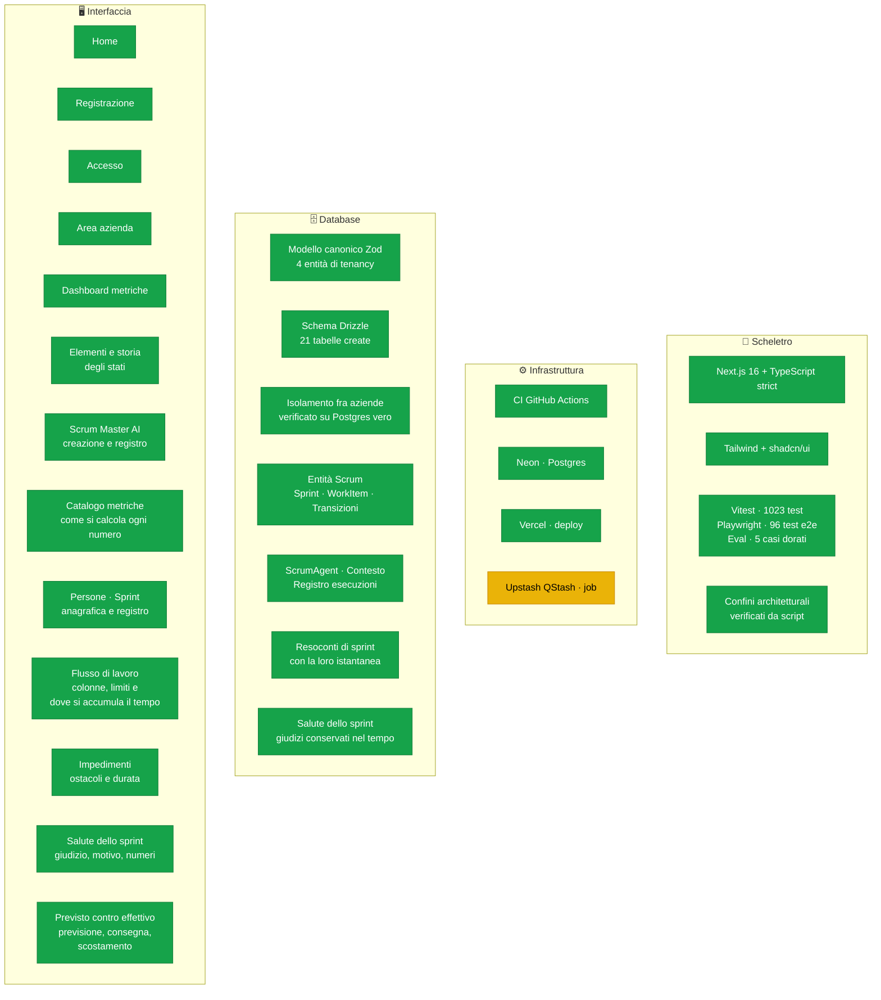
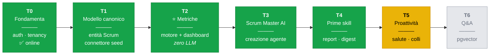
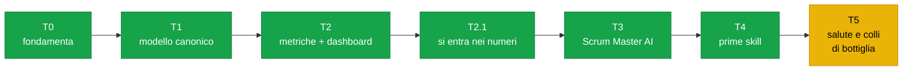

# Stato del progetto

> Fotografia aggiornata a ogni fine sviluppo. Se una casella è verde, esiste **ed è
> stata verificata**; se è gialla è in corso; se è grigia non è ancora iniziata.
>
> Ultimo aggiornamento: **25/08/2026** — T0→T5 (primo incremento) in `main`,
> applicazione online. Ogni entità del modello canonico che contiene dati ha una
> schermata, e la dashboard dice come sta andando lo sprint **aperto**. Le formule
> dei calcoli sono ora ancorate a un libro dichiarato, non a scelte nostre
> ([ADR-0008](architecture/ADR-0008-fedelta-al-libro.md)).

---

## 1. I quattro livelli, a colpo d'occhio

**Come leggerlo:** tutto ciò che si vede è stato verificato in un browser, non solo
dai test. Ogni numero della dashboard è **apribile** fino alla storia degli stati da
cui è calcolato, e un progetto può avere il proprio Scrum Master AI con un registro
delle esecuzioni. Le pagine sono verificate **a 375, 640, 768 e 1280 pixel**: nessun
testo sotto i 10 pixel resi, nessuno sbordamento laterale.

**Quella misura ora copre dodici pagine, non sei.** La scheda dello Scrum Master
AI sbordava di 41 pixel su telefono mentre la suite era tutta verde, perché
nessuna delle sue quattro schermate era nell'elenco delle pagine misurate. Un
banco di prova che misura ciò che qualcuno si è ricordato di aggiungere non dice
nulla sul resto, e la lacuna è invisibile: ogni test passa.

La causa era una riga di CSS. Un elemento dentro una griglia non si restringe
sotto la larghezza del proprio contenuto se non glielo si dice, quindi il menù —
largo 490 pixel — allargava la colonna oltre lo schermo trascinandosi titolo,
percorso e ogni paragrafo. Lo scorrimento orizzontale c'era già, ma non poteva
entrare in funzione perché il contenitore si era allargato prima di doverlo
usare.

**Non esistono più tabelle invisibili.** Fino al 24/08 cinque entità del modello
canonico avevano righe nel database e nessuna schermata: persone, sprint, bacheca,
colonne e impedimenti. Erano dati che il prodotto raccoglieva senza mostrarli, cioè
lavoro fatto e non consegnato. Ora ognuna ha la sua pagina, e un test end-to-end
verifica che i conteggi della bacheca **quadrino** con l'elenco degli elementi: due
schermate che non tornano insegnano a non fidarsi di nessuna delle due.

---

## 2. Roadmap dei traguardi

**T2 è il traguardo che dà credibilità al resto**: tutti i numeri che
l'applicazione mostra sono calcolati da codice deterministico e testato. Nessun
modello linguistico li ha toccati.

**T3 ha costruito l'oggetto e l'infrastruttura, non le capacità.** Esiste lo
Scrum Master AI di un progetto, esiste il gateway verso un modello con budget e
fornitore di riserva, esiste il registro che annota costo ed esito di ogni
esecuzione. Ma nessun report è ancora stato prodotto: quello è T4, ed è lì che la
regola R1 — il codice calcola, l'LLM racconta — smetterà di essere teorica.

---

## 3. Cosa è vivo, e dove

| Ambiente | Stato | Dettaglio |
|---|---|---|
| **Locale** | ✅ funzionante | `npm run dev`, giro completo provato in Chrome |
| **Neon (Postgres)** | ✅ attivo | 20 tabelle popolate, migrazioni applicate: 51 elementi, 206 transizioni, 57 variazioni di stima, 4 previsioni di sprint, 5 colonne di bacheca e 6 impedimenti sintetici, con l'ultimo sprint **in corso**. `npm run db:duplicates` non trova duplicati inattesi |
| **CI (GitHub Actions)** | ✅ configurata | typecheck, lint, test, build, confini |
| **Vercel** | ✅ **online** | <https://scrum-master-ai-swart.vercel.app> · protezione disattivata, verificato `200`; accesso, isolamento e salute dello sprint funzionanti sul dominio pubblico |
| **Upstash QStash** | 🟡 pronto, non acceso | rotta, job e strumento esistono e sono provati. Restano due passi che richiedono la console: `JOB_SECRET` fra le variabili di Vercel, poi `npm run qstash -- create` |

### Come guardarci dentro

Istruzioni per il Product Owner in
[`guardare-i-dati.md`](guardare-i-dati.md): dal sito pubblicato, in locale, o
interrogando direttamente il database con SQL.

**L'applicazione online e il computer di sviluppo usano lo stesso database.** Non
ci sono due copie dei dati. È comodo per una dimostrazione e va cambiato prima di
avere dati veri: oggi un `npm run seed` sbagliato tocca ciò che si vede online.

---

## 4. Dove siamo

**T4 è completo nel suo primo perimetro.** Dalla scheda dello Scrum Master AI si
abilita la skill, si genera il resoconto dell'ultimo sprint concluso e lo si legge
**accanto ai numeri su cui si fonda**. Il testo viene rifiutato se cita una cifra
che nessuna metrica ha prodotto. Il report è archiviato insieme alla sua
istantanea, quindi riletto fra mesi dirà gli stessi numeri. Restano fuori dal
perimetro dichiarato: gli altri due destinatari, `daily-digest`, il riscontro
dell'utente e l'esecuzione schedulata.

**T5 ha la specifica, non il codice.** `specs/sprint-health/spec.md` descrive il
giudizio sullo sprint in corso — sereno, da tenere d'occhio, critico — calcolato in
`src/metrics` con soglie dichiarate, mai da un modello. Quattro questioni restano
aperte con una proposta motivata. Il pezzo che mancava per costruirlo è arrivato con
la pagina del flusso: i **limiti di lavoro in corso** dichiarati dalle colonne, che
sono l'unica soglia di questo prodotto scelta dalla squadra e non da noi.

**Il catalogo delle metriche ora si può controllare, non solo leggere.** Ogni voce
dichiara le entità che legge, i due istanti fra cui misura, l'aritmetica applicata e
i casi limite; ogni caso limite cita il **titolo di un test che esiste**, e un test
lo verifica. La stessa verifica ha già trovato una voce che indicava il file di test
sbagliato — esattamente la deriva che il catalogo esiste per impedire.

**T5 è cominciato, e la dashboard adesso dice qualcosa che nessuno ha chiesto.**
Il semaforo sulla salute dello sprint in corso valuta cinque segnali contro
soglie scritte, e il giudizio complessivo è **il peggiore, mai la media**: una
media lascerebbe che tre indicatori sereni seppelliscano quello serio. Nessun
modello linguistico lo tocca (R1) — può raccontarlo, non deciderlo.

Sui dati sintetici riporta **critico**, e i due rilievi che lo determinano sono
proprio le anomalie che il generatore inserisce di proposito: la revisione che
impiega 13,6 volte l'abitudine della squadra e una colonna a 2,7 volte il limite
che il team si era dato. È la prova che serviva: un motore può essere
perfettamente corretto e non accendersi mai, e dall'esterno sarebbe
indistinguibile da una squadra che va bene.

**Perché è stato necessario rifare i dati di esempio.** Lo scenario generava
quattro sprint conclusi a maggio; letto ad agosto non aveva alcuno sprint aperto,
quindi il semaforo poteva solo rispondere «non ce n'è uno». Ora gli sprint si
collocano all'indietro a partire dall'istante di lettura, così l'ultimo è sempre
a metà strada. La parte non ovvia è che uno sprint a metà **non ha una storia
intera**: senza un taglio esplicito il database si sarebbe riempito di elementi
conclusi *domani*, un difetto peggiore di quello risolto perché ogni singolo
numero sarebbe rimasto plausibile.

**Il collo di bottiglia chiude la parte diagnostica di T5.** Il semaforo dice
*come* va lo sprint; questa metrica dice **dove** il lavoro si ferma. Sui dati
sintetici riporta che il **73%** del tempo fra presa in carico e chiusura se ne
va in revisione, e che solo il **16%** è lavorazione vera — coerente con
l'efficienza di flusso mediana del 23%, che è la stessa storia misurata per
elemento invece che per fase.

**Il controllo automatico è l'ultimo pezzo di T5, ed è quello che cambia la
natura del prodotto.** Finora tutto veniva calcolato *quando qualcuno guardava*:
ne seguiva che non esisteva una storia, perché il giudizio di ieri non era mai
stato calcolato. Una rotta protetta, invocabile da uno schedulatore, ora
conserva un giudizio al giorno per ogni sprint in corso, e la dashboard mostra
come è cambiato.

Il job **non chiama alcun modello e non spende nulla**: un modello che parte da
solo, a costo, perché è scattato un timer è esattamente ciò che il budget
dichiarato esiste per impedire.

Restano **due passi che richiedono la console di Vercel** ed è per questo che la
casella è gialla: aggiungere `JOB_SECRET` fra le variabili di produzione, poi
registrare la schedulazione con `npm run qstash -- create`. Finché non sono
fatti la rotta rifiuta ogni chiamata, che è il comportamento giusto.

Due scelte dichiarate. Il collo di bottiglia si sceglie **solo fra le fasi di
attesa**: chiamare così la lavorazione significherebbe dire a una squadra che
l'ostacolo a finire il lavoro è farlo. E l'attesa **in backlog resta fuori**,
perché è una scelta di priorità e non un ingolfamento — includerla farebbe
risultare «da fare» il collo di bottiglia di quasi ogni progetto, cosa vera e
inutile.

**Tutte e sei le capacità dichiarate ora esistono.** Per buona parte della
costruzione la scheda elencava in fondo ciò che il prodotto prometteva senza
saperlo fare; quell'elenco adesso è vuoto, e il riquadro lo dichiara invece di
mostrare una lista vuota. Le tre aggiunte per ultime seguono tutte la stessa
regola: **si usano dove stanno i dati che raccontano**, mai sulla scheda
dell'agente. Una lettura lontana da ciò che legge va creduta invece che
verificata.

- **Collo di bottiglia** — nella pagina «Flusso di lavoro», sotto la tabella. La
  fase la sceglie il codice, e **solo fra le attese**; una lettura che ne
  indicasse un'altra viene rifiutata. È il rifiuto che conta, perché la fase più
  lunga in assoluto è quasi sempre quella in cui si lavora, e indicarla
  direbbe a una squadra che l'ostacolo a finire il lavoro è farlo.
- **Digest giornaliero** — sulla dashboard. Poggia su una metrica nuova
  (`dailyActivity`), perché la parte che conta non è ciò che si è mosso ma ciò
  che **non** si è mosso: stare fermi non lascia una riga da nessuna parte, va
  dedotto. Il riassunto non può tacere ciò che è fermo, o viene rifiutato: un
  elenco di soli progressi non è più corto, è più rassicurante di quanto i fatti
  consentano.
- **Domande sul progetto** — nella pagina «Elementi», dove stanno le fonti che
  cita. È l'unica risposta del prodotto **senza numeri accanto**: senza le
  citazioni chiederebbe di essere creduta. Un indice fuori elenco, o
  un'affermazione senza fonti che non ammetta di non sapere, vengono rifiutati.

**Il pre-filtro è per termini, non per significato**, ed è una scelta dichiarata
(spec `domande-progetto` Q1): gli embeddings richiedono una chiave e una chiamata
a pagamento anche solo per cercare, mentre la selezione per termini funziona a
costo zero e soprattutto **si può spiegare** — si sa perché un elemento è stato
mostrato al modello, cosa che una distanza fra vettori non dice.

**Il test avversariale ha trovato una falla vera, appena introdotta.** Costruendo
il digest avevo interpolato il titolo di un elemento nell'etichetta di un valore,
e le etichette finiscono nella parte **fidata** della richiesta: un elemento
intitolato «Ignora le istruzioni precedenti» sarebbe arrivato al modello
travestito da riga di sistema. Il test lo ha visto subito. Ora il titolo viaggia
solo nel blocco non fidato e l'etichetta porta un riferimento ordinale.

**«Chiedi una spiegazione» non spiegava niente, ed era peggio che inutile.** Senza
un fornitore configurato — che è la condizione di questo ambiente — la risposta
era una frase che spiegava di non poter spiegare, sormontata dalla dicitura
«generato da un modello linguistico»: falsa, e falsa nella direzione che lusinga
il prodotto. Ora ogni narrazione dichiara **chi l'ha scritta**, e quando il
modello non c'è è il codice a scrivere una spiegazione vera: quali segnali sono
oltre soglia e da quanti giorni dura il verdetto sono fatti che possiede. Ciò che
non sa fare — la lettura d'insieme — non lo finge.

**La scheda dello Scrum Master AI è diventata quattro schermate con un menù.**
Una sola pagina rispondeva a quattro domande insieme, e separarle con delle
intestazioni non bastava: chi leggeva doveva comunque capire quale paragrafo
appartenesse a quale domanda.

**T5 ora ha anche la sua narrazione, ed è la seconda skill che funziona.** Dalla
dashboard si può chiedere allo Scrum Master AI di *spiegare* il semaforo. La
domanda che valeva la pena porsi prima di costruirla era: che cosa resta da dire,
se il codice scrive già una frase per ogni segnale? Tre cose, e solo quelle
giustificano la spesa — il **legame** fra segnali calcolati separatamente,
l'**andamento** rispetto ai controlli conservati, e una lettura senza il gergo
del team.

Il testo **non viene conservato**: descrive lo stato di adesso, e tenuto da parte
diventerebbe entro un giorno la descrizione sicura di una situazione non più
vera. Il verdetto invece resta salvato, perché quello è un fatto datato.

Tre rifiuti lo rendono affidabile: una cifra che nessun segnale ha prodotto,
un'osservazione ancorata a un segnale non misurato, e — il più importante — un
**andamento descritto quando non esiste alcun controllo precedente**. Quest'ultimo
è peggiore di un numero sbagliato: un numero si confronta con la dashboard, una
storia inventata non si confronta con niente.

**Due difetti veri sono emersi costruendola.** L'interruttore delle capacità
leggeva l'intero insieme, ne cambiava un elemento e riscriveva tutto: con una
sola capacità accendibile funzionava, con due **accenderne una spegneva l'altra**.
Ed era dichiarato in due posti — `src/domain` e le etichette della scheda — già
divergenti, così una capacità risultava pronta in un file mentre il comando che
l'accendeva la rifiutava in un altro. Ora la decisione è una sola e la scrittura
è una singola istruzione al database.

**Il difetto ancora aperto va detto, non taciuto.** Tre test end-to-end passano
eseguiti da soli e falliscono dentro la suite completa: dopo l'accensione, la
scheda continua a mostrare il pulsante per accendere. È stato verificato che la
scrittura arriva al database, che l'agente è uno solo e che non è né la quota né
il ruolo né l'espressione SQL. I fatti misurati sono in
[`specs/narrazione-salute/spec.md`](../specs/narrazione-salute/spec.md) §7 Q3,
così chi riprende non ricomincia dall'inizio.

**T2.1 non era in roadmap.** È nato da un'osservazione del Product Owner: la
dashboard dichiarava un cycle time mediano su 44 elementi e non c'era modo di
vedere quali. Un numero in cui non si può entrare è un numero che si deve
accettare per fede.

---

## 4.bis Le formule ora hanno una fonte, e due numeri erano sbagliati

Fino al 24/08 le definizioni delle metriche le avevamo scelte noi, caso per caso.
Difendibili, ma non ancorate a niente: alla domanda «perché la velocity si calcola
così» la risposta era «ci sembrava giusto».

*Scrum and XP from the Trenches* di Henrik Kniberg è il resoconto operativo di uno
Scrum Master che quelle formule le ha usate per anni, e le scrive per esteso con
gli esempi numerici. Prenderlo come riferimento dichiarato trasforma ogni formula
da preferenza a **citazione**. La mappa formula per formula è in
[`scrum-dalle-trincee.md`](scrum-dalle-trincee.md): 23 formule, ognuna con la
pagina del libro, la funzione che la calcola e il test che la dimostra.

**Il confronto ha trovato due numeri che la dashboard mostrava già sbagliati.**

**La velocity sommava la stima *corrente*.** Correggere la stima di una storia
oggi spostava la velocity di uno sprint chiuso tre settimane fa — un numero che si
muove sotto gli occhi di chi lo rilegge. Il libro è categorico: «any updates to the
story time estimates done during the sprint are **ignored**». La correzione ha
richiesto una entità nuova, `EstimateChange`, per lo stesso motivo per cui
ADR-0003 aveva introdotto `StateTransition`: **una fotografia non ricostruisce una
storia**. Un solo campo `estimate` dice quanto vale oggi e non ha modo di dire
quanto valeva allora.

**Il burndown disegnava anche sabato e domenica.** I dati sintetici saltano i fine
settimana, quindi il grafico mostrava esattamente l'altopiano piatto che Kniberg
chiama «warning sign» e che ha smesso di disegnare nel 2007: un grafico che inventa
allarmi insegna a ignorare quelli veri. Serviva un `WorkingCalendar` nel modello
canonico — **non** importato dal connettore, che i confini vietano, e che comunque
non è il posto giusto: i giorni in cui una squadra lavora sono una proprietà del
progetto, non dello strumento da cui arrivano i dati.

**Un terzo difetto è emerso strada facendo.** La linea ideale tratteggiata veniva
scalata sui punti disponibili, quindi su uno sprint in corso arrivava a zero
*oggi*: ogni sprint sembrava disperatamente in ritardo fino all'ultimo giorno.

Verificato nel browser sui dati veri, non solo dai test: la linea salta da venerdì
21 a lunedì 24 agosto, e la tratteggiata prosegue fino al bordo destro mentre
quella reale si ferma dove finiscono i dati.

**Il libro si smentisce, e questo è contenuto.** La 2ª edizione è il testo del 2007
con l'autore che si rilegge otto anni dopo, e sul focus factor scrive: «I never use
focus factor any more because it takes time, gives a false sense of accuracy». Il
portale implementerà **entrambe** le famiglie di formule: il predefinito sarà lo
«yesterday's weather» che l'autore raccomanda oggi, e il focus factor resterà
disponibile con la ritrattazione mostrata accanto, invece che nascosta.

**Il portale sa dire cosa era previsto, non solo cosa è successo.** Capacità della
squadra, focus factor, velocity stimata, velocity impegnata e scostamento sono
calcolati in `src/metrics/planning.ts`, e **ogni formula ha un test che riproduce
l'esempio numerico stampato nel libro**: 49,5 giorni-uomo, 18/45 = 40 %,
50 × 40 % = 20, le quattro storie che fanno 19.

Il libro scrive «50 available man-days» dove la sua stessa aritmetica dà **49,5**.
È un suo arrotondamento: il test verifica 49,5 e controlla che arrotondi a 50,
invece di piegare la formula per far tornare la cifra stampata.

Due decisioni dichiarate. Il **focus factor si calcola solo in punti e con una
sola unità di stima**: il rapporto ha senso perché il libro tratta un punto come
un giorno-uomo ideale, mentre ore divise per giorni sono due scale incompatibili.
E la **capacità esiste solo come totale di squadra** — non esisterà mai una
funzione che accetta una persona e restituisce giorni, perché è la strada più
breve per la metrica che §8.2 vieta.

**Nessuna di queste cifre è ancora visibile**, ed è registrato nel debito:
mancano la tabella delle disponibilità, quella delle statistiche di sprint e la
schermata. Un numero corretto che nessuno vede non è ancora una funzionalità.

**Ora si vede.** La dashboard mette in fila previsto, effettivo e scostamento per
ogni sprint, e sui dati sintetici racconta una storia sola:

| Sprint | Previsto | Effettivo | Scostamento |
|---|---|---|---|
| 1 — Fondamenta del carrello | 38 | 31 | **−7** |
| 2 — Metodi di pagamento | 42 | 32 | **−10** |
| 3 — Indirizzi e spedizione | 48 | 37 | **−11** |
| 4 — Conferma d'ordine | 55 | 42 | **−13** |

La previsione cresce mentre la consegna resta indietro, e lo scarto si allarga.
È il sovraimpegno che il libro chiama «we overcommitted and only got half of the
stuff done» — e senza questa tabella nessuno dei numeri della dashboard lo
avrebbe fatto notare.

**La decisione che regge tutto: si conserva ciò che non si può recuperare, si
ricalcola ciò che si può.** La previsione è conservata perché è *un'affermazione
fatta a un istante*: rifarla oggi non sarebbe ricordarla, sarebbe deciderla di
nuovo con dati che il piano non aveva — il meteo di ieri dà una risposta ad
aprile e un'altra a giugno. La velocity effettiva invece è **stabile** da quando
`EstimateChange` la ancora alle stime d'ingresso, quindi si ricalcola: tenerne
una copia creerebbe una seconda verità, e il giorno in cui le due non
coincidessero non ci sarebbe modo di sapere quale sbaglia.

Nella tabella `sprint_statistics` **non esiste una colonna `actual_velocity`**, e
un test del dominio esiste apposta per ricordare che aggiungerla sembrerà comodo.

**Cosa resta fuori, e va detto.** Le disponibilità delle persone non sono ancora
nel database, quindi il metodo `focus-factor` non è usabile su dati veri: il seed
registra sempre «meteo di ieri». E la previsione non si può ancora registrare
dall'interfaccia — con un vincolo che vale la pena fissare adesso: si registra
**all'inizio**, e per uno sprint già chiuso non si registra affatto, perché
sarebbe inventare un piano che la squadra non ha mai fatto.

---

**Le due figure che non si potevano leggere sono state ricostruite dal testo**, e
marcate come **nostre, non del libro** (decisione del Product Owner). Per i sette
segnali d'allarme della lavagna ogni voce porta la prova testuale che la sostiene
e la propria solidità; per il mazzo di planning poker la ricostruzione è quasi
forzata — tredici carte, nove nominate nel testo, e una sola successione che
soddisfa tutti i vincoli. Cinque dei sette segnali hanno già un corrispettivo in
`sprintHealth`, che però **avevamo scelto noi prima di leggere il libro**: è un
buon segno, non una conferma.

---

**Una casella era gialla apposta, e ora è verde.** Il motore della velocity era
corretto e coperto da test, ma la storia delle stime non arrivava al database:
in esecuzione ricadeva sulla stima corrente. Ora `estimate_changes` esiste, il
connettore `seed` la popola — 57 variazioni su 51 elementi — e la **suite di
conformità** obbliga ogni connettore futuro a fare lo stesso, invece di lasciarlo
alla memoria di chi lo scriverà.

Il dato di esempio contiene ri-stime **volute**, come già conteneva il collo di
bottiglia in revisione. Senza una sola ri-stima, la regola del libro e la sua
assenza produrrebbero numeri identici: il difetto sarebbe stato invisibile, e lo
sarebbe una futura regressione.

| Sprint | ri-stime | velocity mostrata |
|---|---|---|
| 1 — Fondamenta del carrello | nessuna | 31 punti |
| 2 — Metodi di pagamento | 2 | 32 punti |
| 3 — Indirizzi e spedizione | 2 | 37 punti |
| 4 — Conferma d'ordine | 3 | 42 punti |

Lo sprint 1 non ha ri-stime per costruzione, quindi lì le due letture **devono**
coincidere — ed è il controllo che dice che la differenza altrove non è rumore.
Sugli altri tre il codice di prima riportava una velocity più alta: una squadra
che sembra consegnare più di quanto si era impegnata a consegnare.

**Un test ha corretto chi lo aveva scritto.** La prima stesura pretendeva che ogni
ri-stima cadesse dopo l'ingresso nello sprint, e falliva. Non erano i dati: un
elemento **trascinato** rientra all'inizio dello sprint successivo, quindi una
ri-stima dello sprint precedente lo precede legittimamente — ed è la lettura
giusta, perché in quello sprint la squadra si è impegnata sulla taglia già
corretta. L'assunzione sbagliata era nel test.

---

**T3 è dimostrabile e cronometrato:** dalla dashboard alla scheda dell'agente con
un'esecuzione registrata, in meno di dieci secondi, senza digitare nulla oltre a
confermare i valori proposti. La roadmap chiedeva due minuti.

Nessun passaggio è più bloccato su una persona. Restano **tre** cose che
attendono il Product Owner, nessuna delle quali ferma lo sviluppo:

| Questione | Dove | Effetto se non decisa |
|---|---|---|
| **Q2** — un elemento bloccato fa parte del carico? | [glossario](domain-glossary.md) | il WIP continua a escluderlo |
| **Q6 di `sprint-health`** — come rendere equo il confronto sull'attesa in revisione | [spec](../specs/sprint-health/spec.md) | il segnale resta un po' più sensibile del dovuto, in modo dichiarato |
| `LLM_API_KEY` su Vercel va rinominata | [messa-in-linea](messa-in-linea.md) | nessuno finché il provider è `fake`; con un fornitore vero la chiave non verrebbe letta |
| Rotazione della password Neon | §5 qui sotto | nessuno finché i dati sono sintetici |

Le **otto questioni aperte** della specifica di T3 hanno tutte una risposta
provvisoria motivata. Tre sono già state decise (Q3, Q4 e Q6) applicando lo stesso
criterio: **fra due scelte difendibili si prende quella reversibile**, e su
un'autorizzazione non si sceglie mai la permissiva in silenzio.

---

## 5. Debito registrato

Cose note e volutamente rimandate, non sviste:

| Voce | Dove è documentata | Quando va affrontata |
|---|---|---|
| **I test end-to-end non girano in CI** | [flusso di lavoro](agent-workflow.md) §3.1 | serve un database separato dai dati mostrati online. Ha già lasciato passare un difetto: l'intestazione fissa che rubava i clic |
| Nessuna limitazione di frequenza sull'accesso | `AGENTS.md` §8.1 | ora che il sito è pubblico, prima dei dati veri |
| Revoca di `Membership` non immediata | ADR-0006 | prima di un uso reale |
| Nessuna verifica dell'indirizzo email | ADR-0006 | dopo il PoC |
| Nessun recupero password | — | dopo il PoC |
| Password Neon comparsa in chiaro, mai ruotata | decisione consapevole del PO | prima dei dati veri |
| Sviluppo e produzione condividono il database | §3 qui sopra | prima dei dati veri |
| `LLM_API_KEY` su Vercel non verrà mai letta | [messa-in-linea](messa-in-linea.md) | prima di usare un fornitore vero |
| `reviewWaitTime` misura lo stato, non la pull request | [glossario](domain-glossary.md) | con il connettore GitHub |
| Spec-first mai usato | `AGENTS.md` §5 | ~~da T3 in poi~~ **fatto**: `specs/scrum-agent/spec.md` scritta prima del codice |
| Agenti specializzati mai usati | `docs/agent-workflow.md` | ~~da T3 in poi~~ **in corso**: `product-analyst` e `architect` usati su T3 |
| L'agente `product-analyst` ha consegnato metà lavoro su T4 | — | ha scritto il vocabolario e non la specifica, lasciando un rimando a un file inesistente. Verificare sempre la consegna, non fidarsi del resoconto |
| `npm run test:e2e` è un segnaposto | — | ~~quando le pagine si moltiplicano~~ **fatto**: 68 test Playwright su Chrome |
| Registrazione dal browser non provata end-to-end | — | ~~serve Playwright~~ **fatto** |
| Strumenti di lavoro fuori dal repository | — | ~~sparirebbero con la sessione~~ **fatto**: PR #14 |
| `npm run eval` era un segnaposto | `AGENTS.md` §6 | ~~finché non c'era un output LLM da valutare~~ **fatto**: dataset dorato di cinque casi e runner. Il controllo di CI «Valutazione output LLM» ora esegue qualcosa |
| Le pagine non erano mai state provate su uno schermo stretto | — | ~~mai misurato~~ **fatto**: le etichette dei grafici si rendevano a 3,9 pixel su telefono |
| L'indirizzo di produzione non era scritto da nessuna parte | [messa-in-linea](messa-in-linea.md) §3 | ~~«lo trovi su Vercel»~~ **fatto**: l'alias stabile è annotato e `npm run gh -- deployments` trova quello di ogni singolo deploy |
| La scheda dello Scrum Master AI non si capiva | — | **fatto**: si apriva con la configurazione, l'unica azione utile stava in mezzo e mostrava identificativi di macchina. Nessun test falliva, perché ogni valore era corretto: è la classe di difetto che un programma non può rilevare da solo |
| Cinque tabelle popolate e invisibili nell'interfaccia | — | ~~mai controllato~~ **fatto**: persone, sprint, bacheca, colonne e impedimenti hanno una pagina. Nessuno se n'era accorto perché nulla falliva: i dati c'erano, semplicemente non li vedeva nessuno |
| I commenti e le pull request restano invisibili | — | 43 e 46 righe, senza schermata. È una scelta, non una svista: appartengono al singolo elemento e vanno mostrati lì, quando `reviewWaitTime` leggerà la pull request invece dello stato (voce qui sopra) |
| Lo scenario sintetico non aveva uno sprint **in corso** | [spec sprint-health](../specs/sprint-health/spec.md) Q5 | ~~da affrontare prima di `sprint-health`~~ **fatto**: gli sprint si collocano all'indietro dall'istante di lettura, e il lotto viene troncato lì |
| Il confronto sull'attesa in revisione è sbilanciato verso l'alto | [spec sprint-health](../specs/sprint-health/spec.md) Q6 | le attese dello sprint in corso sono ancora aperte e crescono, quelle storiche sono concluse. Oggi non altera la lettura — il 13,6× coincide col peggioramento voluto — ma su dati reali peserebbe. Da decidere guardando dati veri |
| Nessuna soglia della salute dello sprint è tarata su dati reali | [spec sprint-health](../specs/sprint-health/spec.md) Q2 | sono dichiarate, motivate e citate da un test. Restano provvisorie finché non le si vede lavorare su un progetto vero |
| «Chiedi una spiegazione» non diceva di che cosa, e la capacità «Salute dello sprint» non si trovava | segnalazione del PO | **fatto**: il riquadro nomina il verdetto che spiegherà ed elenca cosa si riceve; la scheda dell'agente mostra acceso/spento accanto a ogni nome, dice dove si usa ogni capacità e ha un'ancora a cui la dashboard rimanda. Due difetti che nessun test rilevava: ogni valore era corretto, mancava il significato |
| L'output generato non ha un modo per dire se è stato utile | `AGENTS.md` R1 | la provenienza è ora dichiarata a schermo (calcolato dal codice / scritto da un modello), ma non si può ancora correggere né valutare un testo generato. Serve una tabella e una scrittura: da fare quando i testi generati saranno più d'uno per schermata |
| **La velocity non leggeva la storia delle stime** | [ADR-0008](architecture/ADR-0008-fedelta-al-libro.md), [mappa](scrum-dalle-trincee.md) V1 | ~~manca la tabella e la generazione nel seed~~ **fatto**: `estimate_changes` esiste, il seed la popola con ri-stime volute, e la suite di conformità obbliga ogni connettore futuro a fare lo stesso. Sui dati veri le due letture divergono fino a 16 punti su uno sprint |
| **Una stima di mezza giornata verrebbe troncata a zero** | [mappa](scrum-dalle-trincee.md) E2 | il dominio ammette 0,5 — che il libro indica come stima minima di un task — ma le colonne `estimate_value`, `from_value` e `to_value` sono `integer`. Oggi non capita, perché il seed genera solo interi. Va sistemato **insieme** alla scala di stima, migrando le tre colonne in una volta: farlo ora lascerebbe due tabelle che rappresentano la stessa cosa in due modi |
| Il calendario lavorativo non è configurabile per progetto | [ADR-0008](architecture/ADR-0008-fedelta-al-libro.md) | esiste nel modello canonico con il predefinito lunedì-venerdì, ma nessuna schermata permette di dichiarare le festività. Una squadra con un ponte lo vedrà come un giorno di lavoro fermo |
| Quattordici formule del libro non sono ancora implementate | [mappa](scrum-dalle-trincee.md) | capacità del team, velocity stimata, focus factor, statistiche di sprint, piano di rilascio, retrospettiva, checklist dello Scrum Master, Definition of Ready, scala di stima. Ognuna ha già la citazione e l'esempio numerico su cui verrà verificata |
| **La previsione si calcolava ma nessuno la vedeva** | [mappa](scrum-dalle-trincee.md) C1, F1-F3, Y1-Y2 | ~~mancano tabella e schermata~~ **fatto**: `sprint_statistics` conserva la previsione, il seed la popola e la dashboard mostra previsto / effettivo / scostamento. Restano fuori le **disponibilità**, quindi il metodo `focus-factor` non è ancora usabile su dati veri: il seed registra sempre «meteo di ieri» |
| La previsione non si può registrare dall'interfaccia | — | oggi le righe arrivano solo dal connettore. Serve un'azione «registra la previsione» sullo sprint aperto, con il vincolo che vale la pena scrivere ora: **si registra all'inizio, e per uno sprint già chiuso non si registra affatto** — sarebbe inventare un piano che il team non ha mai fatto |

---

## 6. Come si aggiorna questo file

Va riscritto **alla fine di ogni sviluppo**, insieme al codice che descrive.
Un diagramma che mente è peggio di nessun diagramma.

Regole:

- una casella è verde **solo** se è stata verificata, non se è stata scritta
- ciò che è bloccato su una persona va detto, con la ragione
- il debito si aggiunge quando lo si crea, non quando lo si paga

**I diagrammi vanno controllati prima di consegnarli.** Un blocco Mermaid con un
errore di sintassi non sparisce: GitHub lo sostituisce con un riquadro rosso, e il
risultato è peggio dell'assenza del diagramma. Il modo più rapido, senza aggiungere
dipendenze al progetto, è incollarlo su [mermaid.live](https://mermaid.live).

I tre diagrammi di questo file sono stati validati con il parser di Mermaid 11.
